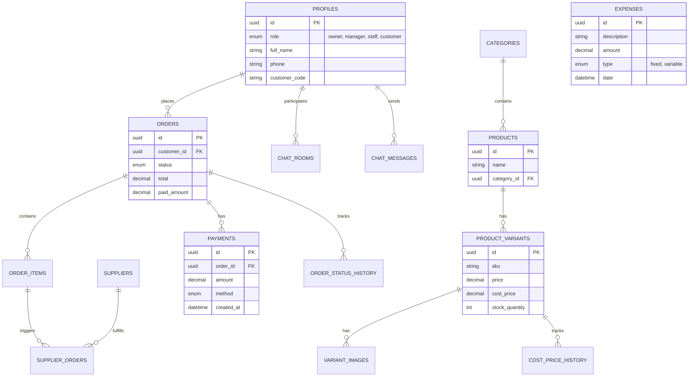

# Phân Tích Cấu Trúc Hệ Thống (System Structure Analysis)

**Nguồn tham khảo**: `docs/bao-gia.csv`
**Ngày phân tích**: 16/01/2026
**Trạng thái hiện tại**: Đã có schema cơ bản (`drizzle/0000_lying_skrulls.sql`), cần bổ sung để khớp với yêu cầu chi tiết.

## 1. Tổng Quan Kiến Trúc (Architecture Overview)

Dựa trên yêu cầu báo giá, hệ thống là một ứng dụng quản lý shop nội bộ (Internal Shop Management System) với kiến trúc Monolithic hoặc Modular Monolith, sử dụng:

- **Frontend/Fullstack Framework**: Next.js (App Router).
- **Database**: PostgreSQL (Supabase).
- **Authentication**: Supabase Auth.
- **Storage**: Supabase Storage (Hình ảnh sản phẩm, chat).
- **Real-time**: Supabase Realtime (Chat, Notifications).
- **Deployment**: Vercel.

## 2. Thiết Kế Cơ Sở Dữ Liệu (Database Schema Design)

Dưới đây là thiết kế schema chi tiết dựa trên các module yêu cầu.

### 2.1 Entity Relationship Diagram (ERD)

### 2.2 Chi Tiết Các Bảng & Gap Analysis

So sánh với schema hiện tại (`drizzle/0000_lying_skrulls.sql`), chúng ta có các phân tích sau:

#### A. Users & Authentication (Module 2, 5)

- **Yêu cầu**: Owner, Manager, Staff (internal admins) và Customer.
- **Lưu ý quan trọng**: Authentication **CHỈ** dành cho nội bộ (Admin/Staff). Khách hàng (Customer) **KHÔNG** có tài khoản đăng nhập. Module 4 (Trang khách hàng) là public view-only catalog.
- **Hiện tại**: `profiles` có field `user_id`.
- **Gap**:
  1.  Cần tách biệt rõ ràng giữa **Internal Users** (có login) và **Customers** (CRM data only).
  2.  `profiles` role `customer` nên được hiểu là data record, `user_id` sẽ NULL.
  3.  Cần cập nhật `enum user_role` thêm `owner`, `manager`, `staff`.

#### B. Products & Inventory (Module 3)

- **Yêu cầu**: Categories, Products, Variants, Images, Cost Price, Stock.
- **Hiện tại**: Đầy đủ (`categories`, `products`, `product_variants`, `variant_images`, `cost_price_history`).
- **Đánh giá**: Tốt. Schema hiện tại đã hỗ trợ tốt việc quản lý biến thể và lịch sử giá vốn.

#### C. Orders (Module 6)

- **Yêu cầu**: Order items, status history, split deliveries, supplier orders (hàng cần order).
- **Hiện tại**: `orders`, `order_items`, `supplier_orders` đã được thiết kế chi tiết. Hỗ trợ `stock_type` (in_stock/pre_order). `supplier_orders` độc lập với `order_items` (chỉ gắn variant_id, supplier_id).
- **Đánh giá**: Tốt. Đơn bán và đơn nhập hàng tạo riêng, không kết nối với nhau.

#### D. Payments & Accounting (Module 7, 9)

- **Yêu cầu**: Thanh toán từng phần (Partial Payment), Lịch sử thanh toán, Chi phí cố định/biến đổi.
- **Hiện tại**: `orders` có fields tổng, nhưng thiếu bảng `payments` để lưu lịch sử giao dịch từng lần. Thiếu bảng `expenses` cho chi phí vận hành shop.
- **Gap**:
  1.  Tạo bảng `payments` (order_id, amount, method, ref_code).
  2.  Tạo bảng `expenses` (type, amount, description, date) để tính P&L (Module 10.2).

#### E. Chat (Module 8)

- **Yêu cầu**: Real-time chat, image upload, read status.
- **Hiện tại**: `chat_rooms`, `message_type`.
- **Gap**: Vì khách hàng không login, Chat Customer UI sẽ cần cơ chế định danh ẩn danh (Anonymous Session / LocalStorage / Cookie) hoặc chỉ là form liên hệ. Cần làm rõ flow này. Schema hiện tại `chat_rooms` require `customer_id` (profile), vẫn ổn nếu tạo profile ẩn cho khách.

## 3. Kiến Trúc Module (Module Breakdown)

### Module 1: Core System

- **Tech**: Next.js (App Router), Drizzle ORM, Shadcn UI.
- **State**: Server Components (read), Server Actions (`use server` mutations, internal-only), Zustand (Global UI state).

### Module 2: Access Control (RBAC) - Internal Only

- **Auth**: Supabase Auth (Email/Password) cho nhân viên.
- **Logic**: Middleware kiểm tra role.
- **Permissions Matrix**:
  - **Owner**: Full access.
  - **Manager**: No access to Finance/P&L reports.
  - **Staff**: Orders & Products interaction only.

### Module 3: CRM (Customer Management)

- **Nature**: Khách hàng là Entity được quản lý bởi Admin/Staff.
- **Catalog View**: Trang Web public cho khách xem sản phẩm (không cần login).

### Module 4: Inventory Logic

- **Stock Management**:
  - Khi tạo đơn -> Check `stock_quantity`; trừ kho phần in_stock có sẵn; không tự động tạo `supplier_orders`.
  - Đơn nhập hàng (`supplier_orders`) tạo riêng bởi Admin; khi status = received -> Cộng tồn kho cho variant (nếu in_stock).

### Module 5: Finance (New)

- Bổ sung module này để quản lý dòng tiền.
- **Revenue**: Tính từ `orders` (đã hoàn thành/đã thanh toán).
- **COGS (Giá vốn)**: Tính từ `order_items.line_cost`.
- **Expenses**: Tính từ bảng `expenses` (lương, điện, nước...).
- **Profit**: Revenue - COGS - Expenses.

## 4. Kế Hoạch Triển Khai (Implementation Roadmap)

1.  **Phase 1: Database Migration (Priority)**
    - Update `profiles` roles.
    - Create `payments` table.
    - Create `expenses` table.
2.  **Phase 2: Backend Services (Route Handlers for HTTP APIs, Server Actions for internal mutations, tRPC optional)**
    - Auth Service (RBAC).
    - Order Service (Complex logic: Split stock/order).
    - Finance Service (Payment processing).
3.  **Phase 3: Admin UI**
    - Dashboard.
    - Product/Order Management.
    - Chat Interface.

## 5. Kết Luận

Cấu trúc hệ thống trong `docs/bao-gia.csv` là khả thi và đã được cover khoảng 80% bởi schema hiện tại. Cần tập trung bổ sung phần **Finance/Accounting** và **RBAC** để hoàn thiện MVP theo yêu cầu.
