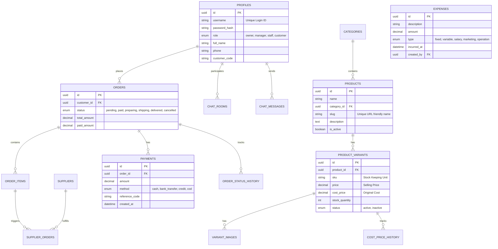

# Database Schema & ERD

## 1. Entity Relationship Diagram

## 2. Table Details

### 2.1 Users & Auth (`profiles`)

Self-managed authentication table.

| Column          | Type | Description                                                                                 |
| :-------------- | :--- | :------------------------------------------------------------------------------------------ |
| `id`            | uuid | Primary Key                                                                                 |
| `username`      | text | Unique identifier for login                                                                 |
| `password_hash` | text | Bcrypt hash of password                                                                     |
| `role`          | enum | `owner` (Full Access), `manager` (No P&L), `staff` (Operations), `customer` (View Only/CRM) |
| `full_name`     | text | Display name                                                                                |
| `phone`         | text | Contact number                                                                              |
| `customer_code` | text | Unique code for CRM tracking (e.g., CUST-001)                                               |

### 2.2 Products (`products`, `product_variants`)

Core catalog structure.

- **Products**: The abstract item (e.g., "T-Shirt Basic").
- **Variants**: The concrete item (e.g., "T-Shirt Basic - Red - L").
- **Cost Price History**: Tracks changes in variable costs for precise P&L calculation over time.

### 2.3 Orders & Finance (`orders`, `payments`, `expenses`)

- **Orders**: The central transaction record.
- **Payments**: Records individual transactions. An order can have multiple payments (Partial Payment).
- **Expenses**: records operational costs not directly tied to COGS (Cost of Goods Sold).

### 2.4 Chat (`chat_rooms`, `messages`)

- **Rooms**: Can be linked to a specific Order or generic Customer Support.
- **Messages**: Text or Image content.

## 3. Row Level Security (RLS) Policies

### Internal Users (Owner, Manager, Staff)

- **Select**: Access to all operational data defined by Role Matrix.
- **Insert/Update**:
  - **Owner**: All tables.
  - **Manager**: All except `expenses` (if sensitive) and `profiles` (role promotion).
  - **Staff**: `orders` (create/update status), `chat` (send), `products` (view only or update stock).

### Customers

- **Select**: Own `orders`, Own `profile`. Public `products` (via public API or role bypass).
- **Insert**: `chat_messages` (contact-based ordering only, orders created by admin).
- **Update**: Own `profile` (limited).
