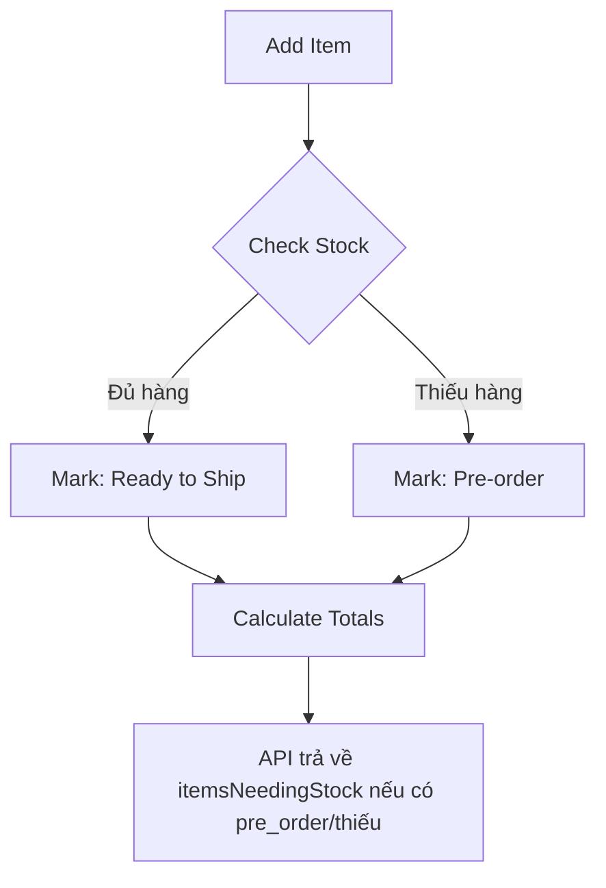

# Spec: Order Management

## Related Epics

- [[Epic-06-OrderManagement]]

## Module Notes

### Module 6: Quản Lý Đơn Hàng (Order Management - Admin Process)

**Mục tiêu**: Xử lý vòng đời đơn hàng phức tạp (Hàng có sẵn + Hàng Order).

---

#### 1. Tính Năng (Features)

- **6.1 Admin Create Order**: Chọn khách, add items.
- **6.2 Mixed Stock Logic**:
  - Đơn có thể gồm item Có Sẵn và item Cần Order.
  - Tách shipment hoặc gộp shipment.
- **6.3 Order Lifecycle**: Draft -> Confirmed -> Processing -> Shipped -> Delivered.
- **6.4 Return/Exchange**: Xử lý đổi trả.

---

#### 2. Thiết Kế (Design)

##### UI Components

- **OrderCreator**:
  - User Search/Selector.
  - Product Search & Add (Line Items).
  - **Auto-split view**: Hiển thị rõ item nào lấy từ kho, item nào cần order NCC.
- **Kanban Board / List View**: Quản lý trạng thái đơn.

---

#### 3. Luồng Logic (Logic Flow)

##### 3.1 Order Creation & Stock Check



###### Technical Note: Drizzle Transactions

Use `db.transaction()` to ensure atomicity. Khi tạo đơn: trừ tồn kho phần có sẵn (in_stock); **không** tự động tạo `supplier_orders`. Đơn nhập hàng (supplier_orders) tạo riêng, độc lập với đơn bán.

##### 3.2 Supplier Order (độc lập với Order)

- `supplier_orders` tạo riêng bởi Admin (đơn nhập hàng), không kết nối với `orders`/`order_items`.
- Khi đơn nhập chuyển "received" → cộng tồn kho cho variant tương ứng (nếu variant là in_stock).

---

#### 4. Dữ Liệu (Schema Requirements)

##### Tables

- **`orders`**: Header đơn hàng.
- **`order_items`**: Chi tiết.
- **`supplier_orders`**: Đơn nhập hàng tạo riêng, không kết nối với đơn bán (orders/order_items). Chỉ gắn `variant_id`, `supplier_id`, số lượng, trạng thái.
  - Status: `pending`, `ordered`, `received`, `cancelled`.
- **`order_status_history`**: Audit log.

## Feature Details

### F04: Quản lý Đơn hàng

#### 1. Tổng quan

##### 1.1 Mục đích

Tài liệu này mô tả chi tiết chức năng quản lý đơn hàng trong hệ thống Shop Management. Module này cho phép Admin tạo và quản lý đơn hàng cho khách hàng, theo dõi trạng thái đơn hàng, và xử lý các đơn hàng cần đặt từ nhà cung cấp.

##### 1.2 Phạm vi

- Tạo đơn hàng cho khách hàng (Admin thực hiện)
- Quản lý trạng thái đơn hàng (pending, paid, preparing, shipping, delivered, cancelled)
- Xử lý đơn hàng pre_order (cần đặt NCC)
- Xác nhận thanh toán
- Tính toán lợi nhuận tự động
- Xem lịch sử đơn hàng (Admin)

##### 1.3 Actors

| Actor  | Mô tả                                                   |
| ------ | ------------------------------------------------------- |
| Admin  | Tạo đơn hàng, cập nhật trạng thái, xác nhận thanh toán  |
| System | Tự động tính profit, sinh mã đơn hàng, cập nhật tồn kho |

---

#### 2. User Stories

##### US-F04-01: Tạo đơn hàng mới

**As an** Admin  
**I want to** tạo đơn hàng cho khách hàng  
**So that** khách hàng có thể mua sản phẩm từ shop

**Acceptance Criteria:**

- Chọn khách hàng từ danh sách
- Thêm sản phẩm/biến thể vào đơn hàng
- Nhập số lượng cho từng sản phẩm
- Hệ thống tự động tính tổng tiền
- Hệ thống tự động tính lợi nhuận dựa trên cost_price
- Lưu đơn hàng với trạng thái "pending"

##### US-F04-02: Xử lý đơn hàng pre_order

**As an** Admin  
**I want to** xử lý các sản phẩm cần đặt từ NCC  
**So that** tôi biết cần đặt gì và theo dõi tiến độ

**Acceptance Criteria:**

- Khi tạo đơn hàng có sản phẩm pre_order hoặc thiếu kho, API trả về `itemsNeedingStock` (không tự động tạo supplier_order)
- Đơn nhập hàng (supplier_orders) tạo riêng, độc lập với đơn bán; danh sách supplier_orders hiển thị theo variant/supplier
- Có thể đánh dấu đã đặt NCC và đã nhận hàng; khi "received" thì cộng tồn kho cho variant (nếu in_stock)
- Trạng thái đơn hàng và supplier_orders quản lý độc lập, không phụ thuộc lẫn nhau

##### US-F04-03: Cập nhật trạng thái đơn hàng

**As an** Admin  
**I want to** cập nhật trạng thái đơn hàng  
**So that** khách hàng biết tiến độ đơn hàng

**Acceptance Criteria:**

- Chuyển trạng thái theo flow: pending → paid → preparing → shipping → delivered
- Có thể hủy đơn hàng (cancelled) từ trạng thái pending/paid
- Ghi lại lịch sử thay đổi trạng thái
- Hoàn trả tồn kho khi hủy đơn

##### US-F04-04: Xác nhận thanh toán

**As an** Admin  
**I want to** xác nhận khách hàng đã thanh toán  
**So that** ghi nhận doanh thu và lợi nhuận

**Acceptance Criteria:**

- Cập nhật `paid_amount` theo số tiền nhận được
- Khi `paid_amount >= total`, chuyển trạng thái đơn hàng thành `paid` và set `paid_at`
- Cho phép thanh toán một phần hoặc toàn bộ

##### US-F04-05: Xem danh sách đơn hàng (Admin)

**As an** Admin  
**I want to** xem tất cả đơn hàng  
**So that** quản lý tổng quan hoạt động bán hàng

**Acceptance Criteria:**

- Danh sách đơn hàng với thông tin: mã đơn, khách hàng, tổng tiền, trạng thái, ngày tạo
- Lọc theo: trạng thái, khách hàng, khoảng thời gian, thanh toán
- Tìm kiếm theo mã đơn hàng
- Sắp xếp theo ngày tạo (mới nhất trước)

##### US-F04-06: Xem chi tiết đơn hàng

**As an** Admin  
**I want to** xem chi tiết một đơn hàng  
**So that** biết thông tin đầy đủ về đơn hàng

**Acceptance Criteria:**

- Thông tin khách hàng (tên, SĐT, địa chỉ)
- Danh sách sản phẩm (tên, SKU, số lượng, đơn giá, thành tiền)
- Tổng tiền, lợi nhuận (chỉ Admin thấy)
- Lịch sử trạng thái
- Ghi chú đơn hàng

##### US-F04-08: Quản lý Supplier Orders

**As an** Admin  
**I want to** quản lý các item cần đặt từ NCC  
**So that** đảm bảo đủ hàng cho khách

**Acceptance Criteria:**

- Danh sách tổng hợp các item cần đặt NCC
- Đánh dấu đã đặt (ordered_at)
- Đánh dấu đã nhận (received_at)
- Lọc theo trạng thái: chờ đặt, đã đặt, đã nhận

---

#### 3. Order Status Flow

##### 3.1 Constants (tái sử dụng, không hardcode)

Trạng thái đơn hàng khai báo trong `lib/constants.ts`:

```typescript
// lib/constants.ts
export const ORDER_STATUS = {
  PENDING: "pending",
  PAID: "paid",
  PREPARING: "preparing",
  SHIPPING: "shipping",
  DELIVERED: "delivered",
  CANCELLED: "cancelled",
} as const;
```

Trong UI chi tiết đơn hàng:

- **ORDER_STATUSES**: khai báo riêng cho từng trạng thái (nhãn hiển thị, màu, icon). Key dùng `ORDER_STATUS.*`.
- **ORDER_STATUS_ACTIONS**: khai báo riêng nút hành động tại mỗi trạng thái (nextStatus + actionLabel). Key và `nextStatus` dùng `ORDER_STATUS.*`.

Nút phải thể hiện **hành động** (vd: "Hủy đơn", "Đánh dấu đã giao"), không dùng nhãn trạng thái làm chữ nút.

##### 3.2 Sơ đồ trạng thái (UI đơn giản)

Luồng chính trên giao diện: **pending → paid → delivered**. Trạng thái `preparing` và `shipping` vẫn tồn tại trong DB và API (tương thích đơn cũ) nhưng không dùng trong luồng nút mặc định.

```
  ┌─────────────┐
  │   pending   │ ← Đơn hàng mới tạo
  └──────┬──────┘
         │ Ghi nhận thanh toán đủ → tự động chuyển paid
         │ Nút: Hủy đơn → cancelled
         ▼
  ┌─────────────┐
  │    paid     │ ← Đã thanh toán đủ (không thể hủy / thanh toán tiếp)
  └──────┬──────┘
         │ Nút: Đánh dấu đã giao → delivered
         ▼
  ┌─────────────┐
  │ delivered   │ ← Giao thành công (terminal)
  └─────────────┘

  cancelled chỉ từ pending (nút "Hủy đơn").
  Đơn paid: ẩn nút "Thanh toán", không có nút "Hủy đơn".
```

##### 3.3 Chi tiết trạng thái và nút hiển thị

| Trạng thái  | Mô tả                             | Nút hành động trên UI (ORDER_STATUS_ACTIONS)                    |
| ----------- | --------------------------------- | --------------------------------------------------------------- |
| `pending`   | Đơn hàng mới tạo, chưa thanh toán | Hủy đơn → cancelled. Có dialog "Thanh toán".                    |
| `paid`      | Đã thanh toán đầy đủ              | Đánh dấu đã giao → delivered. Không hủy, không thanh toán tiếp. |
| `delivered` | Đã giao thành công                | Không nút (terminal)                                            |
| `cancelled` | Đã hủy                            | Không nút (terminal)                                            |

##### 3.4 Quy tắc chuyển trạng thái (API / backend)

API vẫn chấp nhận đầy đủ các trạng thái; UI chỉ hiển thị tập con phù hợp.

```typescript
// Tham chiếu ORDER_STATUS từ lib/constants
import { ORDER_STATUS } from "@/lib/constants";

// Chuyển trạng thái hợp lệ (backend có thể validate):
// pending → paid (tự động khi paid_amount >= total), cancelled
// paid → delivered, (UI không cho cancelled)
// preparing / shipping → delivered, cancelled (đơn cũ)
```

##### 3.5 Quy tắc xoá đơn hàng

> **Lưu ý quan trọng:** Chỉ được phép xoá đơn hàng ở trạng thái `pending` hoặc `cancelled`. Đơn hàng đã giao (`delivered`) hoặc đang xử lý không thể xoá.

> **Phân biệt Huỷ vs Xoá:**
>
> - **Huỷ (Cancel)**: Chuyển trạng thái sang `cancelled`. Trên UI chỉ áp dụng cho `pending` (đơn đã thanh toán không hiển thị nút hủy).
> - **Xoá (Delete)**: Xoá bản ghi khỏi database. Chỉ áp dụng cho `pending` và `cancelled`.

| Trạng thái đơn hàng | Có thể xoá? | Xử lý kho                                      |
| ------------------- | ----------- | ---------------------------------------------- |
| `pending`           | ✅ Có       | Khôi phục số lượng kho cho sản phẩm `in_stock` |
| `cancelled`         | ✅ Có       | Không cần khôi phục (đã được xử lý khi huỷ)    |
| `paid`              | ❌ Không    | -                                              |
| `delivered`         | ❌ Không    | -                                              |

**Quy trình xoá:**

1. Kiểm tra trạng thái đơn hàng
2. Nếu là `pending`: khôi phục số lượng kho cho sản phẩm `in_stock`
3. Xoá đơn hàng (cascade xoá `order_items` và `status_history`). Supplier orders không bị xóa — đơn nhập hàng độc lập với đơn bán.

##### 3.6 Quy tắc chỉnh sửa đơn hàng

| Thông tin                   | Cho phép sửa? | Ghi chú                                                 |
| --------------------------- | ------------- | ------------------------------------------------------- |
| Ghi chú admin (`adminNote`) | ✅ Có         | Có thể sửa bất kỳ lúc nào                               |
| Giảm giá (`discount`)       | ✅ Có         | Hệ thống tự động tính lại `total = subtotal - discount` |
| Sản phẩm / Số lượng         | ❌ Không      | Cần huỷ đơn cũ và tạo đơn mới                           |
| Khách hàng                  | ❌ Không      | Cần huỷ đơn cũ và tạo đơn mới                           |

> **Lý do không cho phép sửa sản phẩm/số lượng:**
>
> - Ảnh hưởng đến tồn kho đã được trừ
> - Cần tính lại profit, subtotal, total_cost
> - Đảm bảo tính nhất quán của dữ liệu

---

#### 4. Luồng nghiệp vụ

##### 4.1 Tạo đơn hàng

```
┌─────────┐     ┌──────────────┐     ┌───────────────┐     ┌─────────────┐
│  Admin  │────▶│ Chọn khách   │────▶│ Thêm sản phẩm │────▶│ Xem tổng kết│
└─────────┘     │    hàng      │     │  vào giỏ      │     │   đơn hàng  │
                └──────────────┘     └───────────────┘     └──────┬──────┘
                                                                  │
                ┌──────────────┐     ┌───────────────┐            │
                │  Đơn hàng    │◀────│   Lưu đơn     │◀───────────┘
                │   đã tạo     │     │    hàng       │
                └──────────────┘     └───────────────┘
```

**Chi tiết xử lý:**

1. **Chọn khách hàng:**

   - Tìm kiếm theo mã KH hoặc tên
   - Hiển thị thông tin: tên, SĐT, loại KH (wholesale/retail)

2. **Thêm sản phẩm:**

   - Tìm kiếm sản phẩm theo tên hoặc SKU
   - Chọn biến thể cụ thể
   - Nhập số lượng
   - Hệ thống kiểm tra tồn kho:
     - `in_stock`: Kiểm tra stock_quantity >= số lượng đặt; trừ kho phần có sẵn
     - `pre_order`: Không trừ kho; API trả về itemsNeedingStock; đơn nhập hàng (supplier_orders) tạo riêng khi cần

3. **Tính toán tự động:**

   ```
   subtotal = Σ(item.price × item.quantity)
   total_cost = Σ(item.cost_price × item.quantity)
   profit = subtotal - total_cost
   ```

4. **Lưu đơn hàng:**
   - Sinh mã đơn hàng: `ORD-YYYYMMDD-XXX`
   - Lưu order với status = 'pending'
   - Lưu order_items với cost_price_at_order_time
   - Trừ tồn kho cho sản phẩm in_stock (phần có sẵn)
   - Không tự động tạo supplier_orders; API trả về itemsNeedingStock nếu có item pre_order/thiếu
   - Ghi order_status_history

##### 4.2 Supplier Orders (độc lập với Order)

Đơn nhập hàng (`supplier_orders`) tạo riêng bởi Admin, không kết nối với đơn bán (`orders`/`order_items`). Chỉ gắn `variant_id`, `supplier_id`, số lượng, trạng thái.

```
┌───────────────────────────────────────────────────────────────────┐
│  Admin tạo đơn nhập hàng (supplier_orders) trực tiếp              │
│  - variant_id, supplier_id, quantity, status: 'pending'           │
└───────────────────────────────────────────────────────────────────┘
                              │
                              ▼
┌───────────────────────────────────────────────────────────────────┐
│  Admin xem danh sách supplier_orders                             │
│  - Lọc theo status: pending (chờ đặt), ordered (đã đặt NCC)      │
│  - Hiển thị theo variant/product (không liên kết order)          │
└───────────────────────────────────────────────────────────────────┘
                              │
              ┌───────────────┴───────────────┐
              ▼                               ▼
┌─────────────────────────┐     ┌─────────────────────────┐
│  Đánh dấu đã đặt NCC    │     │  Đánh dấu đã nhận hàng  │
│  - ordered_at = now()   │────▶│  - received_at = now()  │
│  - status = 'ordered'   │     │  - status = 'received'  │
└─────────────────────────┘     │  - Cộng tồn kho (in_stock) │
                                 └─────────────────────────┘
```

---

#### 5. Thiết kế giao diện

##### 5.1 Trang danh sách đơn hàng (Admin)

```
┌──────────────────────────────────────────────────────────────────────────┐
│  Quản lý Đơn hàng                                    [+ Tạo đơn hàng]    │
├──────────────────────────────────────────────────────────────────────────┤
│                                                                          │
│  ┌────────────────────────────────────────────────────────────────────┐ │
│  │ 🔍 Tìm mã đơn hàng...     [Trạng thái ▼] [Thanh toán ▼] [Từ - Đến] │ │
│  └────────────────────────────────────────────────────────────────────┘ │
│                                                                          │
│  ┌─────────────┬──────────────┬────────────┬───────────┬──────────────┐ │
│  │ Mã đơn      │ Khách hàng   │ Tổng tiền  │ Trạng thái│ Ngày tạo     │ │
│  ├─────────────┼──────────────┼────────────┼───────────┼──────────────┤ │
│  │ORD-20251230-│ KH001        │ 1,500,000đ │ 🟡 Pending│ 30/12/2025   │ │
│  │001          │ Nguyễn Văn A │            │           │ 10:30        │ │
│  ├─────────────┼──────────────┼────────────┼───────────┼──────────────┤ │
│  │ORD-20251229-│ KH002        │ 3,200,000đ │ 🟢 Complet│ 29/12/2025   │ │
│  │003          │ Trần Thị B   │            │ ed        │ 15:45        │ │
│  ├─────────────┼──────────────┼────────────┼───────────┼──────────────┤ │
│  │ORD-20251229-│ KH003        │   850,000đ │ 🔵 Process│ 29/12/2025   │ │
│  │002          │ Lê Văn C     │            │ ing       │ 09:20        │ │
│  └─────────────┴──────────────┴────────────┴───────────┴──────────────┘ │
│                                                                          │
│  Hiển thị 1-10 / 156 đơn hàng                          [◀] [1] [2] [▶]  │
└──────────────────────────────────────────────────────────────────────────┘
```

##### 5.2 Form tạo đơn hàng

```
┌──────────────────────────────────────────────────────────────────────────┐
│  Tạo Đơn hàng mới                                                        │
├──────────────────────────────────────────────────────────────────────────┤
│                                                                          │
│  THÔNG TIN KHÁCH HÀNG                                                    │
│  ┌────────────────────────────────────────────────────────────────────┐ │
│  │ 🔍 Tìm khách hàng (mã KH hoặc tên)...                              │ │
│  └────────────────────────────────────────────────────────────────────┘ │
│                                                                          │
│  ┌────────────────────────────────────────────────────────────────────┐ │
│  │ 👤 KH001 - Nguyễn Văn A                                            │ │
│  │    📱 0901234567  |  📍 123 Nguyễn Huệ, Q1, TP.HCM                 │ │
│  │    🏷️ Khách lẻ                                               [✕]  │ │
│  └────────────────────────────────────────────────────────────────────┘ │
│                                                                          │
│  ──────────────────────────────────────────────────────────────────────  │
│                                                                          │
│  SẢN PHẨM                                                                │
│  ┌────────────────────────────────────────────────────────────────────┐ │
│  │ 🔍 Tìm sản phẩm (tên hoặc SKU)...                   [+ Thêm SP]    │ │
│  └────────────────────────────────────────────────────────────────────┘ │
│                                                                          │
│  ┌──────────────────────────────────────────────────────────────────┐   │
│  │ Sản phẩm           │ SKU      │ Đơn giá   │ SL │ Thành tiền    │   │
│  ├──────────────────────────────────────────────────────────────────┤   │
│  │ Kem dưỡng da ABC   │ ABC-001  │ 350,000đ  │ 2  │ 700,000đ  [🗑]│   │
│  │ [📦 Còn hàng]      │          │           │    │               │   │
│  ├──────────────────────────────────────────────────────────────────┤   │
│  │ Son môi XYZ - Đỏ   │ XYZ-RED  │ 250,000đ  │ 3  │ 750,000đ  [🗑]│   │
│  │ [⏳ Cần đặt NCC]   │          │           │    │               │   │
│  └──────────────────────────────────────────────────────────────────┘   │
│                                                                          │
│  ──────────────────────────────────────────────────────────────────────  │
│                                                                          │
│  GHI CHÚ                                                                 │
│  ┌────────────────────────────────────────────────────────────────────┐ │
│  │ Giao buổi chiều, gọi trước 30 phút...                              │ │
│  └────────────────────────────────────────────────────────────────────┘ │
│                                                                          │
│  ──────────────────────────────────────────────────────────────────────  │
│                                                                          │
│  TỔNG KẾT                                                                │
│  ┌────────────────────────────────────────────────────────────────────┐ │
│  │                                        Tạm tính:      1,450,000đ   │ │
│  │                                        Giá vốn:         950,000đ   │ │
│  │                                        ─────────────────────────   │ │
│  │                                        Lợi nhuận:       500,000đ   │ │
│  └────────────────────────────────────────────────────────────────────┘ │
│                                                                          │
│                                          [Hủy]    [💾 Tạo đơn hàng]     │
└──────────────────────────────────────────────────────────────────────────┘
```

##### 5.3 Chi tiết đơn hàng (Admin view)

```
┌──────────────────────────────────────────────────────────────────────────┐
│  Đơn hàng #ORD-20251230-001                                              │
│  Trạng thái: 🟡 Đang chờ xử lý (pending)                                 │
├──────────────────────────────────────────────────────────────────────────┤
│                                                                          │
│  ┌────────────────────────────────┐  ┌─────────────────────────────────┐│
│  │ KHÁCH HÀNG                     │  │ THANH TOÁN                      ││
│  │ KH001 - Nguyễn Văn A           │  │ Trạng thái: ❌ Chưa thanh toán  ││
│  │ 📱 0901234567                  │  │                                 ││
│  │ 📍 123 Nguyễn Huệ, Q1, TP.HCM  │  │ [✓ Xác nhận đã thanh toán]      ││
│  │ 🏷️ Khách lẻ                    │  │                                 ││
│  └────────────────────────────────┘  └─────────────────────────────────┘│
│                                                                          │
│  CHI TIẾT ĐƠN HÀNG                                                       │
│  ┌────────────────────────────────────────────────────────────────────┐ │
│  │ Sản phẩm              │ SKU      │Đơn giá   │ SL │ Thành tiền     │ │
│  ├────────────────────────────────────────────────────────────────────┤ │
│  │ Kem dưỡng da ABC      │ ABC-001  │ 350,000đ │ 2  │ 700,000đ       │ │
│  │ Son môi XYZ - Đỏ      │ XYZ-RED  │ 250,000đ │ 3  │ 750,000đ       │ │
│  ├────────────────────────────────────────────────────────────────────┤ │
│  │                                          Tạm tính:    1,450,000đ   │ │
│  │                                          Giá vốn:       950,000đ   │ │
│  │                                          Lợi nhuận:     500,000đ   │ │
│  └────────────────────────────────────────────────────────────────────┘ │
│                                                                          │
│  ⏳ CẦN ĐẶT TỪ NCC                                                       │
│  ┌────────────────────────────────────────────────────────────────────┐ │
│  │ • Son môi XYZ - Đỏ (XYZ-RED) × 3 - Chưa đặt                        │ │
│  │   [Đánh dấu đã đặt NCC]                                            │ │
│  └────────────────────────────────────────────────────────────────────┘ │
│                                                                          │
│  GHI CHÚ                                                                 │
│  ┌────────────────────────────────────────────────────────────────────┐ │
│  │ Giao buổi chiều, gọi trước 30 phút                                 │ │
│  └────────────────────────────────────────────────────────────────────┘ │
│                                                                          │
│  LỊCH SỬ TRẠNG THÁI                                                      │
│  ┌────────────────────────────────────────────────────────────────────┐ │
│  │ 📅 30/12/2025 10:30 - Tạo đơn hàng (pending)                       │ │
│  └────────────────────────────────────────────────────────────────────┘ │
│                                                                          │
│  CẬP NHẬT TRẠNG THÁI                                                     │
│  [Xác nhận đơn hàng]  [❌ Hủy đơn hàng]                                  │
└──────────────────────────────────────────────────────────────────────────┘
```

##### 5.4 Danh sách Supplier Orders

```
┌──────────────────────────────────────────────────────────────────────────┐
│  Đơn hàng cần đặt NCC                                                    │
├──────────────────────────────────────────────────────────────────────────┤
│                                                                          │
│  ┌────────────────────────────────────────────────────────────────────┐ │
│  │ [Trạng thái ▼]  Tất cả | Chờ đặt (5) | Đã đặt (3) | Đã nhận (12)  │ │
│  └────────────────────────────────────────────────────────────────────┘ │
│                                                                          │
│  ┌──────────────────────────────────────────────────────────────────┐   │
│  │ Sản phẩm        │ SKU     │ SL │Đơn hàng        │Trạng thái │     │   │
│  ├──────────────────────────────────────────────────────────────────┤   │
│  │ Son môi XYZ-Đỏ  │ XYZ-RED │ 3  │ORD-20251230-001│ ⏳ Chờ đặt│[...]│   │
│  │ Kem chống nắng  │ KCN-001 │ 2  │ORD-20251230-001│ ⏳ Chờ đặt│[...]│   │
│  │ Nước hoa ABC    │ NH-ABC  │ 1  │ORD-20251229-005│ 📦 Đã đặt │[...]│   │
│  └──────────────────────────────────────────────────────────────────┘   │
│                                                                          │
│  [Dropdown menu khi click [...]]                                         │
│  ┌────────────────────┐                                                  │
│  │ ✓ Đánh dấu đã đặt  │                                                  │
│  │ ✓ Đánh dấu đã nhận │                                                  │
│  │ 📋 Xem đơn hàng    │                                                  │
│  └────────────────────┘                                                  │
└──────────────────────────────────────────────────────────────────────────┘
```

#### 6. API & Code Implementation

##### 6.1 Types và constants

Dùng `ORDER_STATUS` từ `lib/constants.ts` thay vì hardcode chuỗi:

```typescript
// lib/constants.ts
export const ORDER_STATUS = {
  PENDING: "pending",
  PAID: "paid",
  PREPARING: "preparing",
  SHIPPING: "shipping",
  DELIVERED: "delivered",
  CANCELLED: "cancelled",
} as const;
```

```typescript
// types/order.ts – OrderStatus lấy từ constant
import { ORDER_STATUS } from "@/lib/constants";
export type OrderStatus = (typeof ORDER_STATUS)[keyof typeof ORDER_STATUS];
// Giá trị: "pending" | "paid" | "preparing" | "shipping" | "delivered" | "cancelled"

export interface Order {
  id: string;
  order_number: string; // ORD-YYYYMMDD-XXX
  customer_id: string;
  status: OrderStatus;
  subtotal: number;
  total_cost: number;
  profit: number;
  paid_amount: number;
  notes?: string;
  paid_at?: string;
  created_at: string;
  updated_at: string;
  // Relations
  customer?: Profile;
  items?: OrderItem[];
  status_history?: OrderStatusHistory[];
}

export interface OrderItem {
  id: string;
  order_id: string;
  variant_id: string;
  quantity: number;
  price: number; // Giá bán tại thời điểm đặt
  cost_price_at_order_time: number; // Giá vốn tại thời điểm đặt
  // Relations
  variant?: ProductVariant;
}

export interface OrderStatusHistory {
  id: string;
  order_id: string;
  status: OrderStatus;
  notes?: string;
  created_by?: string;
  created_at: string;
}

export interface SupplierOrder {
  id: string;
  order_id: string;
  variant_id: string;
  quantity: number;
  status: "pending" | "ordered" | "received" | "cancelled";
  ordered_at?: string;
  received_at?: string;
  // Relations
  order?: Order;
  variant?: ProductVariant;
}

export interface CreateOrderInput {
  customer_id: string;
  items: {
    variant_id: string;
    quantity: number;
  }[];
  notes?: string;
}

export interface OrderFilters {
  status?: OrderStatus;
  customer_id?: string;
  date_from?: string;
  date_to?: string;
  search?: string; // order_number
}
```

##### 6.2 Model Functions

```typescript
// models/order.server.ts

import { createClient } from "@/lib/supabase/server";
import type {
  Order,
  CreateOrderInput,
  OrderFilters,
  SupplierOrder,
} from "@/types/order";

/**
 * Lấy danh sách đơn hàng (Admin)
 */
export async function getOrders(
  request: Request,
  filters: OrderFilters = {}
): Promise<{ orders: Order[]; total: number }> {
  const supabase = createServerClient(request);

  let query = supabase.from("orders").select(
    `
      *,
      customer:profiles!customer_id(
        id, full_name, customer_code, phone
      ),
      items:order_items(
        id, quantity, price, cost_price_at_order_time,
        variant:product_variants(
          id, sku, name,
          product:products(id, name)
        )
      )
    `,
    { count: "exact" }
  );

  // Apply filters
  if (filters.status) {
    query = query.eq("status", filters.status);
  }
  if (filters.customer_id) {
    query = query.eq("customer_id", filters.customer_id);
  }
  if (filters.date_from) {
    query = query.gte("created_at", filters.date_from);
  }
  if (filters.date_to) {
    query = query.lte("created_at", filters.date_to);
  }
  if (filters.search) {
    query = query.ilike("order_number", `%${filters.search}%`);
  }

  const { data, error, count } = await query.order("created_at", {
    ascending: false,
  });

  if (error) throw error;

  return {
    orders: data || [],
    total: count || 0,
  };
}

/**
 * Lấy chi tiết đơn hàng
 */
export async function getOrderById(
  request: Request,
  orderId: string
): Promise<Order | null> {
  const supabase = createServerClient(request);

  const { data, error } = await supabase
    .from("orders")
    .select(
      `
      *,
      customer:profiles!customer_id(*),
      items:order_items(
        *,
        variant:product_variants(
          *,
          product:products(*),
          images:variant_images(*)
        )
      ),
      status_history:order_status_history(*)
    `
    )
    .eq("id", orderId)
    .single();

  if (error) throw error;
  return data;
}

/**
 * Tạo đơn hàng mới
 */
export async function createOrder(
  request: Request,
  input: CreateOrderInput,
  createdBy: string
): Promise<Order> {
  const supabase = createServerClient(request);

  // 1. Lấy thông tin variants để tính toán
  const { data: variants, error: variantError } = await supabase
    .from("product_variants")
    .select("id, price, cost_price, stock_type, stock_quantity")
    .in(
      "id",
      input.items.map((i) => i.variant_id)
    );

  if (variantError) throw variantError;

  // 2. Validate stock cho in_stock items
  for (const item of input.items) {
    const variant = variants?.find((v) => v.id === item.variant_id);
    if (!variant) {
      throw new Error(`Variant ${item.variant_id} không tồn tại`);
    }
    if (
      variant.stock_type === "in_stock" &&
      variant.stock_quantity < item.quantity
    ) {
      throw new Error(`Sản phẩm ${item.variant_id} không đủ tồn kho`);
    }
  }

  // 3. Tính toán subtotal, total_cost, profit
  let subtotal = 0;
  let totalCost = 0;

  const orderItems = input.items.map((item) => {
    const variant = variants!.find((v) => v.id === item.variant_id)!;
    const itemTotal = variant.price * item.quantity;
    const itemCost = variant.cost_price * item.quantity;

    subtotal += itemTotal;
    totalCost += itemCost;

    return {
      variant_id: item.variant_id,
      quantity: item.quantity,
      price: variant.price,
      cost_price_at_order_time: variant.cost_price,
      stock_type: variant.stock_type,
    };
  });

  const profit = subtotal - totalCost;

  // 4. Tạo order (trigger sẽ tự sinh order_number)
  const { data: order, error: orderError } = await supabase
    .from("orders")
    .insert({
      customer_id: input.customer_id,
      status: "pending",
      subtotal,
      total_cost: totalCost,
      profit,
      paid_amount: 0,
      notes: input.notes,
    })
    .select()
    .single();

  if (orderError) throw orderError;

  // 5. Tạo order_items
  const itemsToInsert = orderItems.map((item) => ({
    order_id: order.id,
    variant_id: item.variant_id,
    quantity: item.quantity,
    price: item.price,
    cost_price_at_order_time: item.cost_price_at_order_time,
  }));

  const { error: itemsError } = await supabase
    .from("order_items")
    .insert(itemsToInsert);

  if (itemsError) throw itemsError;

  // 6. Trừ tồn kho cho in_stock items
  for (const item of orderItems) {
    if (item.stock_type === "in_stock") {
      const { error: stockError } = await supabase.rpc("decrement_stock", {
        p_variant_id: item.variant_id,
        p_quantity: item.quantity,
      });
      if (stockError) throw stockError;
    }
  }

  // 7. Tạo supplier_orders cho pre_order items
  const preOrderItems = orderItems.filter((i) => i.stock_type === "pre_order");
  if (preOrderItems.length > 0) {
    const supplierOrders = preOrderItems.map((item) => ({
      order_id: order.id,
      variant_id: item.variant_id,
      quantity: item.quantity,
      status: "pending",
    }));

    const { error: supplierError } = await supabase
      .from("supplier_orders")
      .insert(supplierOrders);

    if (supplierError) throw supplierError;
  }

  // 8. Ghi lịch sử trạng thái
  await supabase.from("order_status_history").insert({
    order_id: order.id,
    status: "pending",
    notes: "Tạo đơn hàng mới",
    created_by: createdBy,
  });

  return order;
}

/**
 * Cập nhật trạng thái đơn hàng
 */
export async function updateOrderStatus(
  request: Request,
  orderId: string,
  newStatus: OrderStatus,
  updatedBy: string,
  notes?: string
): Promise<Order> {
  const supabase = createServerClient(request);

  // 1. Lấy order hiện tại
  const { data: order, error: fetchError } = await supabase
    .from("orders")
    .select("*, items:order_items(*)")
    .eq("id", orderId)
    .single();

  if (fetchError) throw fetchError;

  // 2. Validate transition
  const STATUS_TRANSITIONS: Record<OrderStatus, OrderStatus[]> = {
    pending: ["paid", "cancelled"],
    paid: ["preparing", "cancelled"],
    preparing: ["shipping"],
    shipping: ["delivered"],
    delivered: [],
    cancelled: [],
  };

  const allowedTransitions = STATUS_TRANSITIONS[order.status as OrderStatus];
  if (!allowedTransitions.includes(newStatus)) {
    throw new Error(`Không thể chuyển từ ${order.status} sang ${newStatus}`);
  }

  // 3. Nếu hủy đơn, hoàn trả tồn kho
  if (newStatus === "cancelled") {
    for (const item of order.items) {
      // Lấy thông tin variant để check stock_type
      const { data: variant } = await supabase
        .from("product_variants")
        .select("stock_type")
        .eq("id", item.variant_id)
        .single();

      if (variant?.stock_type === "in_stock") {
        await supabase.rpc("increment_stock", {
          p_variant_id: item.variant_id,
          p_quantity: item.quantity,
        });
      }
    }

    // Supplier orders độc lập với order — không xóa khi hủy đơn
  }

  // 4. Cập nhật order
  const { data: updated, error: updateError } = await supabase
    .from("orders")
    .update({ status: newStatus })
    .eq("id", orderId)
    .select()
    .single();

  if (updateError) throw updateError;

  // 5. Ghi lịch sử
  await supabase.from("order_status_history").insert({
    order_id: orderId,
    status: newStatus,
    notes,
    created_by: updatedBy,
  });

  return updated;
}

/**
 * Xác nhận thanh toán
 */
export async function confirmPayment(
  request: Request,
  orderId: string,
  paidAmount: number
): Promise<Order> {
  const supabase = createServerClient(request);

  const { data, error } = await supabase
    .from("orders")
    .update({
      paid_amount: paidAmount,
      paid_at: new Date().toISOString(),
      status: "paid",
    })
    .eq("id", orderId)
    .select()
    .single();

  if (error) throw error;
  return data;
}

/**
 * Lấy danh sách supplier orders
 */
export async function getSupplierOrders(
  request: Request,
  status?: "pending" | "ordered" | "received" | "cancelled"
): Promise<SupplierOrder[]> {
  const supabase = createServerClient(request);

  let query = supabase
    .from("supplier_orders")
    .select(
      `
      *,
      variant:product_variants(
        id, sku, name,
        product:products(id, name)
      )
    `
    )
    .order("created_at", { ascending: false });

  if (status) {
    query = query.eq("status", status);
  }

  const { data, error } = await query;
  if (error) throw error;
  return data || [];
}

/**
 * Cập nhật supplier order
 */
export async function updateSupplierOrder(
  request: Request,
  supplierOrderId: string,
  action: "mark_ordered" | "mark_received"
): Promise<SupplierOrder> {
  const supabase = createServerClient(request);

  const updateData =
    action === "mark_ordered"
      ? { status: "ordered", ordered_at: new Date().toISOString() }
      : { status: "received", received_at: new Date().toISOString() };

  const { data, error } = await supabase
    .from("supplier_orders")
    .update(updateData)
    .eq("id", supplierOrderId)
    .select()
    .single();

  if (error) throw error;
  return data;
}
```

##### 6.3 Database Functions

```sql
-- Function: Trừ tồn kho
CREATE OR REPLACE FUNCTION decrement_stock(
  p_variant_id UUID,
  p_quantity INTEGER
) RETURNS VOID AS $$
BEGIN
  UPDATE product_variants
  SET stock_quantity = stock_quantity - p_quantity
  WHERE id = p_variant_id
    AND stock_type = 'in_stock'
    AND stock_quantity >= p_quantity;

  IF NOT FOUND THEN
    RAISE EXCEPTION 'Không đủ tồn kho hoặc sản phẩm không tồn tại';
  END IF;
END;
$$ LANGUAGE plpgsql SECURITY DEFINER;

-- Function: Cộng tồn kho (khi hủy đơn)
CREATE OR REPLACE FUNCTION increment_stock(
  p_variant_id UUID,
  p_quantity INTEGER
) RETURNS VOID AS $$
BEGIN
  UPDATE product_variants
  SET stock_quantity = stock_quantity + p_quantity
  WHERE id = p_variant_id
    AND stock_type = 'in_stock';
END;
$$ LANGUAGE plpgsql SECURITY DEFINER;

-- Trigger: Tự động sinh order_number
CREATE OR REPLACE FUNCTION generate_order_number()
RETURNS TRIGGER AS $$
DECLARE
  today_prefix TEXT;
  seq_num INTEGER;
BEGIN
  today_prefix := 'ORD-' || TO_CHAR(CURRENT_DATE, 'YYYYMMDD') || '-';

  SELECT COALESCE(MAX(
    CAST(SUBSTRING(order_number FROM LENGTH(today_prefix) + 1) AS INTEGER)
  ), 0) + 1
  INTO seq_num
  FROM orders
  WHERE order_number LIKE today_prefix || '%';

  NEW.order_number := today_prefix || LPAD(seq_num::TEXT, 3, '0');

  RETURN NEW;
END;
$$ LANGUAGE plpgsql;

CREATE TRIGGER set_order_number
  BEFORE INSERT ON orders
  FOR EACH ROW
  EXECUTE FUNCTION generate_order_number();
```

##### 6.4 Route Handlers (Next.js App Router)

```typescript
// app/api/admin/orders/route.ts
import { NextResponse } from "next/server";
import { getInternalUser } from "@/lib/auth.server";
import { getOrders } from "@/services/order.server";

export async function GET(request: Request) {
  const user = await getInternalUser(request);
  if (!user)
    return NextResponse.json({ error: "Unauthorized" }, { status: 401 });

  const url = new URL(request.url);
  const filters = {
    status: url.searchParams.get("status") || undefined,
    search: url.searchParams.get("q") || undefined,
    date_from: url.searchParams.get("from") || undefined,
    date_to: url.searchParams.get("to") || undefined,
  };

  const { orders, total } = await getOrders(filters);
  return NextResponse.json({ orders, total });
}
```

```tsx
// app/admin/(dashboard)/orders/page.tsx
import { getOrders } from "@/services/order.server";

export default async function OrdersPage({
  searchParams,
}: {
  searchParams: { status?: string; q?: string; from?: string; to?: string };
}) {
  const { orders } = await getOrders({
    status: searchParams.status,
    search: searchParams.q,
    date_from: searchParams.from,
    date_to: searchParams.to,
  });

  return <OrdersClient initialOrders={orders} />;
}
```

```tsx
// app/admin/(dashboard)/orders/[id]/page.tsx
import { getOrderDetails } from "@/services/order.server";

export default async function OrderDetailPage({
  params,
}: {
  params: { id: string };
}) {
  const order = await getOrderDetails(params.id);
  return <OrderDetailClient order={order} />;
}
```

---

#### 7. Validation Rules

##### 7.1 Tạo đơn hàng

| Field              | Rule                             | Message                               |
| ------------------ | -------------------------------- | ------------------------------------- |
| customer_id        | Required, phải tồn tại           | "Vui lòng chọn khách hàng"            |
| items              | Required, ít nhất 1 item         | "Đơn hàng phải có ít nhất 1 sản phẩm" |
| items[].variant_id | Required, phải tồn tại           | "Sản phẩm không tồn tại"              |
| items[].quantity   | Required, > 0                    | "Số lượng phải lớn hơn 0"             |
| items[].quantity   | <= stock_quantity (nếu in_stock) | "Không đủ tồn kho"                    |
| notes              | Max 1000 ký tự                   | "Ghi chú không quá 1000 ký tự"        |

##### 7.2 Cập nhật trạng thái

| Transition                                  | Condition                                    | Ghi chú UI                                                   |
| ------------------------------------------- | -------------------------------------------- | ------------------------------------------------------------ |
| pending → paid                              | Thanh toán đủ (paid_amount >= total) tự động | Nút "Thanh toán" chỉ khi chưa paid                           |
| pending → cancelled                         | -                                            | Nút "Hủy đơn"                                                |
| paid → delivered                            | -                                            | Chỉ nút "Đánh dấu đã giao"; không hủy, không thanh toán tiếp |
| preparing / shipping → delivered, cancelled | -                                            | Đơn cũ (tương thích)                                         |

---

#### 8. Test Cases

##### TC-F04-01: Tạo đơn hàng thành công (sản phẩm in_stock)

**Precondition:** Sản phẩm ABC-001 có stock_quantity = 10
**Steps:**

1. Chọn khách hàng KH001
2. Thêm ABC-001, số lượng 2
3. Nhấn "Tạo đơn hàng"
   **Expected:**

- Đơn hàng được tạo với status = 'pending'
- order_number format: ORD-YYYYMMDD-XXX
- stock_quantity của ABC-001 giảm còn 8
- order_status_history có 1 record

##### TC-F04-02: Tạo đơn hàng với sản phẩm pre_order

**Precondition:** Sản phẩm XYZ-RED có stock_type = 'pre_order'
**Steps:**

1. Chọn khách hàng KH001
2. Thêm XYZ-RED, số lượng 3
3. Nhấn "Tạo đơn hàng"
   **Expected:**

- Đơn hàng được tạo thành công
- API trả về itemsNeedingStock (ví dụ XYZ-RED, quantity 3). Không tự động tạo supplier_orders; Admin tạo đơn nhập riêng nếu cần.

##### TC-F04-03: Không đủ tồn kho

**Precondition:** Sản phẩm ABC-001 có stock_quantity = 5
**Steps:**

1. Chọn khách hàng KH001
2. Thêm ABC-001, số lượng 10
3. Nhấn "Tạo đơn hàng"
   **Expected:**

- Hiển thị lỗi "Không đủ tồn kho"
- Không tạo đơn hàng

##### TC-F04-04: Chuyển trạng thái hợp lệ

**Precondition:** Đơn hàng ORD-001 có status = 'pending'
**Steps:**

1. Mở chi tiết đơn hàng ORD-001
2. Nhấn "Xác nhận đơn hàng"
   **Expected:**

- status chuyển thành 'paid'
- order_status_history có thêm record mới

##### TC-F04-05: Chuyển trạng thái không hợp lệ

**Precondition:** Đơn hàng ORD-001 có status = 'delivered'
**Steps:**

1. Cố gắng chuyển sang 'cancelled' qua API
   **Expected:**

- Trả về lỗi 400 "Không thể chuyển từ delivered sang cancelled"

##### TC-F04-06: Hủy đơn hàng hoàn trả tồn kho

**Precondition:**

- Đơn hàng ORD-001 có item ABC-001 × 3
- ABC-001 stock_quantity hiện tại = 7 (ban đầu 10, đã trừ 3)
  **Steps:**

1. Hủy đơn hàng ORD-001
   **Expected:**

- status = 'cancelled'
- ABC-001 stock_quantity = 10

##### TC-F04-07: Xác nhận thanh toán

**Precondition:** Đơn hàng ORD-001 có `paid_amount = 0`
**Steps:**

1. Nhấn "Xác nhận đã thanh toán"
   **Expected:**

- paid_amount được cập nhật theo số tiền thanh toán
- nếu `paid_amount >= total` thì status = 'paid' và `paid_at` có giá trị timestamp

##### TC-F04-09: Đánh dấu supplier order đã đặt

**Precondition:** supplier_order SO-001 có status = 'pending'
**Steps:**

1. Nhấn "Đánh dấu đã đặt NCC"
   **Expected:**

- status = 'ordered'
- ordered_at có giá trị timestamp

##### TC-F04-10: Tính profit đúng

**Steps:**

1. Tạo đơn hàng với:
   - Item A: price = 100,000, cost_price = 60,000, qty = 2
   - Item B: price = 200,000, cost_price = 150,000, qty = 1
     **Expected:**

- subtotal = 100,000×2 + 200,000×1 = 400,000
- total_cost = 60,000×2 + 150,000×1 = 270,000
- profit = 400,000 - 270,000 = 130,000

---

#### 9. Business Rules

##### 9.1 Order Number

- Format: `ORD-YYYYMMDD-XXX`
- XXX là số thứ tự trong ngày, bắt đầu từ 001
- Ví dụ: ORD-20251230-001, ORD-20251230-002

##### 9.2 Profit Calculation

- profit = subtotal - total_cost
- cost_price được lưu tại thời điểm tạo đơn (cost_price_at_order_time)
- Nếu cost_price thay đổi sau khi tạo đơn, không ảnh hưởng đến profit đã tính

##### 9.3 Stock Management

- **in_stock**: Trừ tồn kho ngay khi tạo đơn (phần có sẵn), hoàn trả full quantity khi hủy/xóa đơn
- **pre_order**: Không trừ tồn kho; đơn nhập hàng (supplier_orders) tạo riêng, độc lập với đơn bán

##### 9.4 Order Cancellation

- Chỉ có thể hủy khi status = pending hoặc paid
- Hoàn trả tồn kho cho sản phẩm in_stock (full quantity). Supplier orders không bị ảnh hưởng (độc lập).

#### 10. Security Considerations

##### 10.1 Row Level Security (RLS)

```sql
-- Policy: Admin có thể xem tất cả orders
CREATE POLICY "Admins can view all orders"
ON orders FOR SELECT
TO authenticated
USING (
  EXISTS (
    SELECT 1 FROM profiles
    WHERE profiles.id = auth.uid()
    AND profiles.role = 'admin'
  )
);

-- Policy: Chỉ Admin tạo được orders
CREATE POLICY "Only admins can create orders"
ON orders FOR INSERT
TO authenticated
WITH CHECK (
  EXISTS (
    SELECT 1 FROM profiles
    WHERE profiles.id = auth.uid()
    AND profiles.role = 'admin'
  )
);

-- Policy: Chỉ Admin cập nhật orders
CREATE POLICY "Only admins can update orders"
ON orders FOR UPDATE
TO authenticated
USING (
  EXISTS (
    SELECT 1 FROM profiles
    WHERE profiles.id = auth.uid()
    AND profiles.role = 'admin'
  )
);
```

##### 10.2 Data Protection

- cost_price, total_cost, profit chỉ trả về cho Admin
- Validate customer_id thuộc về hồ sơ khách hàng hiện có

---

#### 11. Revision History

| Version | Date       | Author | Changes         |
| ------- | ---------- | ------ | --------------- |
| 1.0     | 30/12/2025 | Claude | Initial version |
