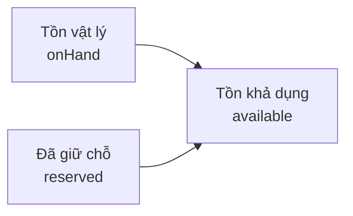

## Mô tả

Trang **Quản lý kho** cho phép Quản lý theo dõi tồn kho từng biến thể (SKU) với 3 chỉ số: **Tồn vật lý**, **Đã giữ chỗ**, **Tồn khả dụng**. Trang cảnh báo SKU sắp hết hoặc hết hàng để lên kế hoạch nhập kịp thời.

Quản lý có **toàn quyền** xem dữ liệu kho như Chủ shop.

## Cách truy cập

Menu bên trái → **Quản lý kho** (mục **Kho vận**).

## 3 cột tồn kho

| Cột | Công thức / nguồn | Ý nghĩa |
|-----|-------------------|---------|
| **Tồn vật lý** (`onHand`) | Số liệu kho thực tế | Số đơn vị thực tế trong kho |
| **Đã giữ chỗ** (`reserved`) | Tổng SL trong các đơn chưa giao | Hàng đã đặt nhưng chưa xuất kho |
| **Tồn khả dụng** (`available`) | `onHand − reserved` | Số có thể bán cho đơn mới |

## Cảnh báo nhanh

Banner đỏ ở đầu trang khi có SP sắp hết hoặc hết hàng:

> **N SP sắp hết** · **M SP đã hết hàng**

## Thẻ thống kê

Cụm `MetricStatBar` 4 ô.

| Thẻ | Cách tính |
|-----|-----------|
| **Tổng SKU** | Tổng biến thể đang quản lý (paginated count) |
| **Còn hàng** | `MAX(0, totalSkus − lowStock − outOfStock)` (xanh emerald) |
| **Sắp hết** | `COUNT(productVariants)` có `0 < onHand ≤ COALESCE(lowStockThreshold, 30)` (vàng) |
| **Hết hàng** | `COUNT(productVariants)` có `onHand ≤ 0` (đỏ) |

## 3 tab dữ liệu

### Tab "Tồn kho"

Hiển thị toàn bộ sản phẩm (50 SP đầu).

| Cột | Nội dung |
|-----|---------|
| **Sản phẩm** | Thumbnail + tên |
| **Danh mục** | Pill màu danh mục |
| **Tồn khả dụng** | Đỏ khi 0, vàng khi dưới ngưỡng |
| **Tồn vật lý** | `onHand` |
| **Đã giữ chỗ** | `reserved` |

### Tab "Sắp hết"

Biến thể có `onHand` dưới ngưỡng nhưng > 0.

| Cột | Nội dung |
|-----|---------|
| **Sản phẩm / SKU** | Tên SP + biến thể + SKU |
| **Tồn** | `onHand` (chữ vàng) |
| **Tình trạng** | Pill **Sắp hết** |

### Tab "Hết hàng"

Biến thể có `onHand` = 0.

| Cột | Nội dung |
|-----|---------|
| **Sản phẩm / SKU** | Tên SP + biến thể + SKU |
| **Tồn** | 0 (chữ đỏ) |
| **Tình trạng** | Pill **Hết hàng** |

## Các thao tác

<Steps>
  <Step title="Kiểm tra cảnh báo">
    Banner đỏ tóm tắt số SKU sắp/hết. Nhấn tab tương ứng để xem chi tiết.
  </Step>
  <Step title="Xem từng biến thể">
    Tab **Tồn kho** hiển thị 3 cột tồn cho mỗi SP.
  </Step>
  <Step title="Tạo đơn nhập từ cảnh báo">
    Sang trang **Đơn nhập hàng** → **Tạo đơn nhập** → chọn biến thể.
  </Step>
</Steps>

## Ngưỡng cảnh báo

`minLowStockThreshold` mặc định **30**. Có thể chỉnh trên trang chi tiết sản phẩm để phù hợp tốc độ bán.

<Warning>
Nút **Điều chỉnh kho** ở góc tab hiện chưa có chức năng — đang phát triển. Chưa thể điều chỉnh kho thủ công từ giao diện.
</Warning>

<Note>
Tồn kho tự động giảm khi đơn được tạo (chuyển sang **Đã giữ chỗ**) và quay về kho khi đơn bị huỷ. Đơn nhập từ NCC cộng vào **Tồn vật lý** sau khi xác nhận **Đã nhận**.
</Note>
