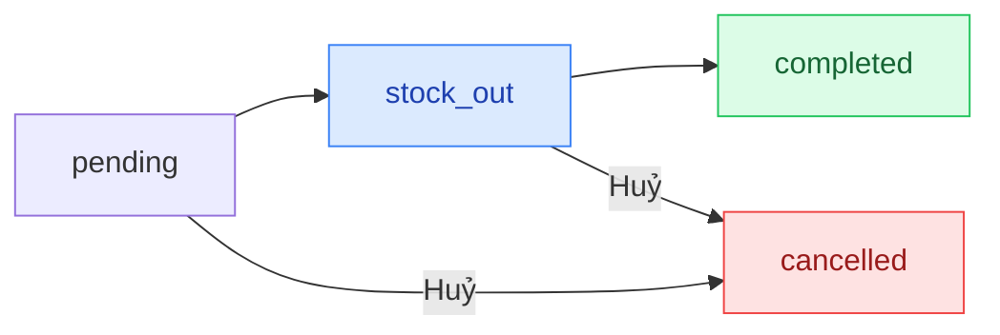

## Mô tả

Trang Đơn hàng là trung tâm xử lý mọi đơn của khách. Mỗi đơn có **2 trạng thái song song**: thanh toán và xử lý (fulfillment).

## Cách truy cập

Menu bên trái → **Đơn hàng**.

## Trạng thái đơn hàng

### Thanh toán (`paymentStatus`)

| Mã | Hiển thị |
|----|---------|
| `unpaid` | Chưa thanh toán |
| `partial` | Một phần |
| `paid` | Đã thanh toán |

### Xử lý (`fulfillmentStatus`)

| Mã | Hiển thị | Ý nghĩa |
|----|---------|---------|
| `pending` | Chờ xử lý | Đơn vừa tạo |
| `stock_out` | Đã xuất kho | Hàng đã lấy khỏi kho để giao |
| `completed` | Hoàn thành | Khách đã nhận hàng |
| `cancelled` | Đã huỷ | Đơn bị huỷ |

### Vòng đời chuẩn

## Trang danh sách

- **Tab lọc:** Tất cả · Chờ xử lý · Đã xuất kho · Hoàn thành · Đã huỷ.
- **Ô tìm kiếm:** mã đơn / tên / SĐT.
- **Xuất Excel:** xuất danh sách đang lọc.
- **Tạo đơn:** chuyển đến `/orders/new` để tạo đơn thủ công.

Bảng hiển thị: Mã đơn · Khách hàng · SĐT · Số lượng · Tổng tiền · Thanh toán · Trạng thái · Thời gian · Chi tiết.

## Các thao tác chính

<Steps>
  <Step title="Tạo đơn thủ công">
    Nhấn **Tạo đơn** → chọn khách → thêm sản phẩm → cấu hình giao hàng và giảm giá → **Lưu**.
  </Step>
  <Step title="Ghi nhận thanh toán">
    Mở chi tiết đơn → **Thanh toán** → nhập số tiền, phương thức (Tiền mặt / Chuyển khoản / Thẻ), mã tham chiếu → **Lưu thanh toán**.
  </Step>
  <Step title="Cập nhật trạng thái xử lý">
    Tuỳ trạng thái hiện tại, nút hành động sẽ là **Đánh dấu xuất kho**, **Đánh dấu hoàn thành**, hoặc **Huỷ đơn**. Có thể thêm ghi chú vào dòng thời gian.
  </Step>
  <Step title="Chỉnh sửa ghi chú và giảm giá">
    Cột phải → **Chỉnh sửa** → cập nhật **Ghi chú admin** và **Giảm giá (VND)** → **Lưu**.
  </Step>
  <Step title="In hoá đơn">
    Nút **In hoá đơn** ở góc phải tiêu đề trang chi tiết.
  </Step>
</Steps>

## Đơn hàng tách (Split Orders)

Khi đơn gốc có cả hàng có sẵn và hàng đặt trước (khách chọn "Giao hàng khi có hàng"), hệ thống tự tách thành đơn con A (in_stock) và đơn con B (pre_order). Mỗi đơn con có trạng thái riêng.

<Note>
Tồn kho được giữ chỗ ngay khi đơn được tạo và trả về kho khi đơn bị huỷ.
</Note>
