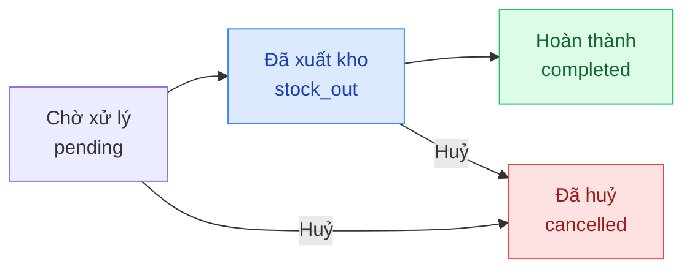

## Mô tả

Trang **Đơn hàng** là trung tâm xử lý mọi đơn của khách. Mỗi đơn có **2 trạng thái song song**:

- **Trạng thái thanh toán** (`paymentStatus`): theo dõi tiền đã thu.
- **Trạng thái xử lý** (`fulfillmentStatus`): theo dõi giao hàng / hoàn thành.

<Note>
Quản lý có đầy đủ quyền tương tự Chủ shop trên tính năng này — tạo đơn, ghi nhận thanh toán, cập nhật trạng thái, sửa nội dung đơn, xuất hoá đơn, xoá đơn đã huỷ.
</Note>

## Cách truy cập

Menu bên trái → **Đơn hàng**.

## Trạng thái đơn hàng

### Trạng thái thanh toán

| Mã | Hiển thị | Ý nghĩa |
|----|---------|---------|
| `unpaid` | Chưa thanh toán | Khách chưa trả đồng nào |
| `partial` | Một phần | Đã thu một phần, vẫn còn nợ |
| `paid` | Đã thanh toán | Đã thu đủ |

### Trạng thái xử lý (fulfillment)

| Mã | Hiển thị | Ý nghĩa |
|----|---------|---------|
| `pending` | Chờ xử lý | Đơn vừa tạo, chưa xuất kho |
| `stock_out` | Đã xuất kho | Hàng đã được lấy ra để giao |
| `completed` | Hoàn thành | Khách đã nhận hàng |
| `cancelled` | Đã huỷ | Đơn bị huỷ |

### Vòng đời chuẩn

<Note>
**Tồn kho**: được giữ chỗ (`reserved`) khi đơn tạo, chuyển thành xuất kho khi sang `stock_out`, trả về kho khi `cancelled`.
</Note>

## Trang danh sách

### Tab lọc nhanh

**Tất cả** · **Chờ xử lý** · **Đã xuất kho** · **Hoàn thành** · **Đã huỷ**.

### Tìm kiếm

Ô **Tìm mã đơn, khách hàng...** — debounce 300ms, lọc theo mã đơn / tên / SĐT.

### Hành động

- **Xuất Excel** — xuất danh sách đang lọc.
- **Tạo đơn** — chuyển đến `/orders/new`.

### Cột bảng

| Cột | Nội dung |
|-----|---------|
| **Mã đơn** | Mã đơn hàng (font monospace) |
| **Khách hàng** | Tên đầy đủ |
| **SĐT** | Số điện thoại |
| **Số lượng** | Số món |
| **Tổng tiền** | Tổng (in đỏ) |
| **Thanh toán** | Badge: Chưa TT / Một phần / Đã TT |
| **Trạng thái** | Badge fulfillment |
| **Thời gian** | Ngày giờ tạo đơn |

### Phân trang

Cuối bảng — dropdown **10 / 25 / 50 / 100**. Mặc định **25**.

## Tạo đơn hàng thủ công

Form `/orders/new` chia 2 cột:

### Cột trái — Khách & sản phẩm

<Steps>
  <Step title="Chọn khách">
    Tìm khách có sẵn (debounce 300ms) hoặc chuyển tab **Khách mới** để nhập **Tên** + **SĐT** ngay tại form.
  </Step>
  <Step title="Thêm sản phẩm">
    Selector tìm và chọn biến thể → tự thêm vào bảng (SL = 1, có thể chỉnh).
  </Step>
  <Step title="Tinh chỉnh">
    Trong bảng có thể đổi SL, đặt **giá tuỳ biến**, hoặc xoá dòng.
  </Step>
</Steps>

### Cột phải — Cấu hình

| Thẻ | Mô tả |
|-----|------|
| **Ghi chú đơn hàng** | Ghi chú nội bộ |
| **Địa chỉ giao hàng** | Người nhận, SĐT, Địa chỉ — tuỳ chọn |
| **Phí ship** | Switch **Trả phí ship hộ khách** + ô số tiền |
| **Tổng quan** | Tạm tính · Phí ship · Tổng cộng + nút **Tạo đơn hàng** |

Đơn được tạo ở `pending` / `unpaid`, redirect về `/orders/{id}`.

## Trang chi tiết đơn

### Ghi nhận thanh toán

<Steps>
  <Step title="Mở dialog">
    Nhấn nút **Thanh toán** ở header (chỉ hiện khi `paymentStatus !== paid`).
  </Step>
  <Step title="Nhập thông tin">
    - **Số tiền** — tối đa = số còn nợ.
    - **Phương thức** — Tiền mặt / Chuyển khoản / Thẻ.
    - **Mã tham chiếu** — chỉ hiện với Chuyển khoản.
    - **Ghi chú** — nội bộ.
  </Step>
  <Step title="Lưu">
    Nhấn **Lưu thanh toán** — mỗi lần tạo 1 dòng trong **Lịch sử thanh toán**.
  </Step>
</Steps>

### Cập nhật trạng thái xử lý

| Trạng thái hiện tại | Nút khả dụng |
|---------------------|---------------|
| `pending` | **Xuất kho** · **Huỷ đơn** · **Thanh toán** (nếu chưa đủ) |
| `stock_out` | **Hoàn tất đơn** (nếu đã đủ) · **Thanh toán** (nếu chưa đủ) |
| `completed` | *(trạng thái cuối)* |
| `cancelled` | **Xoá đơn hàng** (cột phải) |

Phần **Ghi chú cập nhật** dưới chi tiết — nhập trước khi nhấn nút trạng thái để lưu vào dòng thời gian.

### Sửa danh sách sản phẩm trong đơn

Chỉ với đơn `pending` không phải đơn cha/con đã tách:

<Steps>
  <Step title="Nhấn Sửa">
    Nút **Sửa** trên thẻ "Chi tiết sản phẩm".
  </Step>
  <Step title="Chỉnh">
    Thêm biến thể, đổi SL, đổi đơn giá, xoá dòng.
  </Step>
  <Step title="Lưu">
    Nhấn **Lưu** — tổng tiền và tồn kho `reserved` cập nhật.
  </Step>
</Steps>

### Xuất hoá đơn

Dropdown **Xuất hoá đơn** — 3 lựa chọn:

| Tuỳ chọn | Hành động |
|----------|----------|
| **Sao chép** | Copy ảnh hoá đơn vào clipboard |
| **Xuất file ảnh** | Tải PNG |
| **Xuất file PDF** | Tải PDF |

Thông tin cửa hàng (tên, địa chỉ, MST, logo) lấy từ **Cài đặt → Cửa hàng**.

### Chỉnh ghi chú & giảm giá

<Steps>
  <Step title="Mở chỉnh sửa">
    Cột phải → nhấn **Chỉnh sửa**.
  </Step>
  <Step title="Cập nhật">
    **Ghi chú admin** (nội bộ) · **Giảm giá (VND)**.
  </Step>
  <Step title="Lưu">
    Nhấn **Lưu**.
  </Step>
</Steps>

### Xoá đơn

Chỉ xoá được đơn đã `cancelled`. Nút **Xoá đơn hàng** xuất hiện ở cuối cột phải.

<Warning>
Xoá đơn là **không thể hoàn tác**. Lịch sử đơn mất vĩnh viễn.
</Warning>

## Đơn hàng tách (Split Orders)

Khi khách chọn **Giao hàng khi có hàng** và đơn có cả hàng có sẵn lẫn hàng đặt trước, đơn gốc tự tách:

- **Đơn con A** (suffix `A`) — hàng có sẵn (`in_stock`).
- **Đơn con B** (suffix `B`) — hàng đặt trước (`pre_order`).

Mỗi đơn con xử lý độc lập và có trạng thái riêng.
