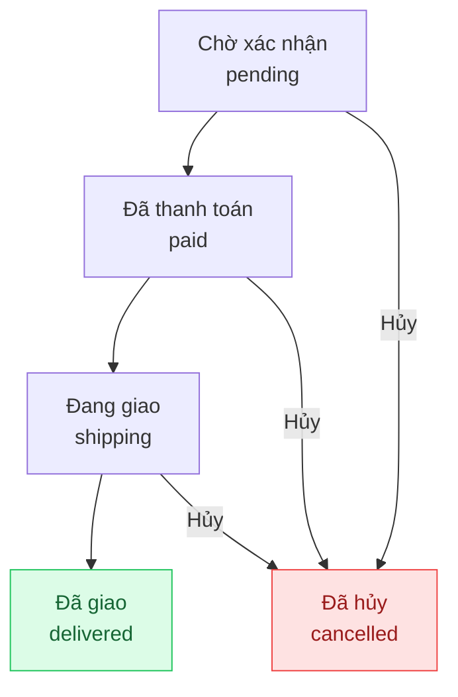

## Mô tả

Trang Đơn hàng là trung tâm xử lý tất cả đơn hàng của khách hàng. Bạn có thể xem, ghi nhận thanh toán, cập nhật trạng thái và theo dõi lịch sử từng đơn.

## Cách truy cập

Menu bên trái → **Đơn hàng**.

## Vòng đời đơn hàng

Đơn hàng có thể bị hủy (`cancelled`) ở bất kỳ bước nào trước khi giao.

## Trang danh sách

### Thẻ thống kê

Đầu trang hiển thị 4 thẻ tổng quan:

| Thẻ | Ý nghĩa |
|-----|---------|
| **Tổng đơn hàng** | Tổng số đơn trong hệ thống |
| **Chờ xử lý** | Số đơn đang ở trạng thái `pending`, cần xác nhận |
| **Hoàn thành** | Số đơn đã giao thành công |
| **Tổng doanh thu** | Tổng tiền từ tất cả đơn hàng |

### Tìm kiếm và lọc

<Steps>
  <Step title="Tìm kiếm đơn hàng">
    Nhập mã đơn hoặc tên/số điện thoại khách vào ô **Tìm mã đơn hàng, khách hàng...** ở góc trái thanh công cụ. Kết quả lọc ngay khi nhập.
  </Step>
  <Step title="Lọc theo trạng thái">
    Nhấn nút **Tất cả trạng thái** → chọn trạng thái cần xem từ danh sách: Chờ xử lý, Đã thanh toán, Đang đóng gói, Đang giao, Đã giao, Đã hủy.
  </Step>
</Steps>

### Bảng đơn hàng

Mỗi hàng hiển thị:

| Cột | Nội dung |
|-----|---------|
| **Mã đơn** | Số thứ tự đơn hàng (ví dụ: #1042) |
| **Khách hàng** | Tên và số điện thoại |
| **Trạng thái** | Badge màu theo trạng thái hiện tại |
| **Tổng tiền** | Giá trị đơn hàng |
| **Ngày tạo** | Thời điểm đặt hàng |

Nhấn **Xem chi tiết** ở cuối hàng để mở trang chi tiết.

## Trang chi tiết đơn hàng

### Ghi nhận thanh toán

<Steps>
  <Step title="Mở hộp thoại thanh toán">
    Nhấn nút **Thanh toán** (màu xanh lá) ở góc phải tiêu đề trang.
  </Step>
  <Step title="Nhập thông tin thanh toán">
    Điền các trường trong hộp thoại:
    - **Số tiền thanh toán** — nhập số tiền khách trả lần này (tối đa bằng số tiền còn nợ hiển thị bên dưới)
    - **Phương thức** — chọn một trong ba: **Tiền mặt**, **Chuyển khoản**, **Thẻ**
    - **Mã tham chiếu** — nhập mã giao dịch ngân hàng (chỉ xuất hiện khi chọn Chuyển khoản)
    - **Ghi chú** — ghi chú nội bộ, tùy chọn
  </Step>
  <Step title="Lưu thanh toán">
    Nhấn **Lưu thanh toán**. Hệ thống cập nhật số tiền đã thu và thêm mục vào **Lịch sử thanh toán**. Khi khách thanh toán đủ, trạng thái đơn tự chuyển sang **Đã thanh toán**.
  </Step>
</Steps>

<Note>
Đơn hàng hỗ trợ thanh toán nhiều lần. Mỗi lần thu tiền được ghi nhận riêng — hệ thống cộng dồn và hiển thị phần còn lại để bạn dễ theo dõi.
</Note>

### Cập nhật trạng thái

Các nút hành động xuất hiện ở góc phải tiêu đề, thay đổi theo trạng thái hiện tại:

| Trạng thái hiện tại | Nút hành động |
|---------------------|---------------|
| Chờ xác nhận | **Hủy đơn** |
| Đã thanh toán | **Đánh dấu đã giao** |
| Đang đóng gói | **Đánh dấu đã giao** · **Hủy đơn** |
| Đang giao | **Đánh dấu đã giao** · **Hủy đơn** |
| Đã giao / Đã hủy | *(trạng thái cuối — không có hành động)* |

<Steps>
  <Step title="Thêm ghi chú cập nhật (tùy chọn)">
    Cuộn xuống phần **Ghi chú cập nhật**, nhập lý do hoặc ghi chú cho lần chuyển trạng thái này (ví dụ: "Khách đổi địa chỉ"). Ghi chú này sẽ lưu vào dòng thời gian **Lịch sử trạng thái**.
  </Step>
  <Step title="Nhấn nút hành động">
    Nhấn nút tương ứng ở tiêu đề trang. Hộp thoại xác nhận xuất hiện → nhấn **OK** để xác nhận.
  </Step>
</Steps>

### Lịch sử trạng thái

Phần **Lịch sử trạng thái** hiển thị dòng thời gian toàn bộ các lần chuyển trạng thái, bao gồm:
- Tên trạng thái và thời điểm
- Người thực hiện cập nhật
- Ghi chú kèm theo (nếu có)

### Chỉnh sửa ghi chú và giảm giá

<Steps>
  <Step title="Mở chế độ chỉnh sửa">
    Trong cột thông tin bên phải, nhấn nút **Chỉnh sửa**.
  </Step>
  <Step title="Cập nhật nội dung">
    - **Ghi chú admin** — ghi chú nội bộ, không hiển thị cho khách hàng
    - **Giảm giá (VND)** — nhập số tiền chiết khấu áp dụng cho đơn hàng
  </Step>
  <Step title="Lưu">
    Nhấn **Lưu** để áp dụng thay đổi.
  </Step>
</Steps>

### In hóa đơn

Nhấn **In hóa đơn** ở góc phải tiêu đề để in hoặc xuất PDF hóa đơn đơn hàng.

### Xóa đơn hàng

Chỉ có thể xóa đơn hàng ở trạng thái **Đã hủy**. Nút **Xóa** xuất hiện ở cuối cột phải sau khi đơn đã bị hủy.

<Warning>
Xóa đơn hàng là thao tác không thể hoàn tác. Toàn bộ lịch sử đơn sẽ bị xóa vĩnh viễn.
</Warning>

## Đơn hàng tách (Split Orders)

Khi khách chọn **Giao hàng khi có hàng** lúc đặt, hệ thống tự động tách đơn gốc thành các đơn con:

- **Đơn con** hiển thị banner _"Đơn hàng được tách từ đơn gốc"_ kèm link quay về đơn gốc.
- **Đơn gốc** hiển thị danh sách các đơn con với loại hàng (Hàng có sẵn / Hàng đặt trước) và trạng thái riêng.
- Mỗi đơn con được xử lý và theo dõi hoàn toàn độc lập.
