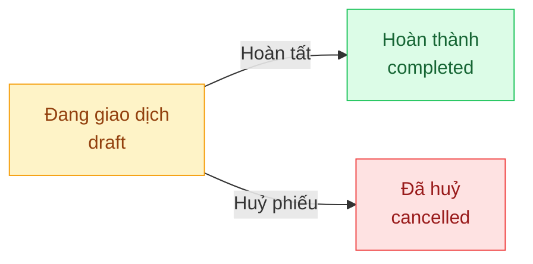

## Mô tả

Trang **Nhập hàng** quản lý phiếu nhập hàng (Goods Receipt Note — GRN). Mỗi phiếu ghi nhận hàng thực tế về kho, theo dõi công nợ NCC và cập nhật giá vốn bình quân (WAC) khi hoàn tất.

Quản lý có **toàn quyền** với chức năng này như Chủ shop.

## Cách truy cập

Menu bên trái → **Nhập hàng** (mục **Kho vận**).

## Vòng đời phiếu nhập

| Trạng thái | Ý nghĩa |
|-----------|---------|
| **Đang giao dịch** | Phiếu đang xử lý — có thể ghi nhận thanh toán |
| **Hoàn thành** | Tồn kho đã cập nhật, giá vốn đã tính lại |
| **Đã huỷ** | Phiếu bị huỷ (chỉ khi chưa có thanh toán) |

### Trạng thái thanh toán

| Trạng thái | Ý nghĩa |
|-----------|---------|
| **Chưa thanh toán** | Chưa trả tiền NCC |
| **Thanh toán một phần** | Đã trả một phần |
| **Đã thanh toán** | Đã trả đủ — điều kiện để nút **Hoàn tất** mở trên giao diện hiện tại |

## Tạo phiếu nhập

Có 2 cách tạo phiếu:

**Cách 1 — Từ đơn đặt hàng (khuyến nghị):**
Vào chi tiết đơn đặt hàng ở trạng thái **Đã đặt** → nhấn **Tạo phiếu nhập**. Hệ thống tự điền NCC, sản phẩm và giá nhập.

**Cách 2 — Tạo thủ công:**
Nhấn **Tạo phiếu nhập** trên trang danh sách → điền thủ công toàn bộ thông tin.

<Steps>
  <Step title="Thông tin phiếu">
    | Trường | Bắt buộc |
    |--------|---------|
    | Nhà cung cấp | Không (cần có để ghi nhận thanh toán) |
    | Ngày lập phiếu | Không |
    | Mã hoá đơn NCC | Không |
    | Mã đặt hàng liên kết | Không |
  </Step>
  <Step title="Thêm sản phẩm">
    Tìm kiếm và chọn biến thể. Nhập số lượng, đơn giá nhập, chiết khấu từng dòng.
  </Step>
  <Step title="Chiết khấu và phí phát sinh">
    Có thể nhập chiết khấu tổng hoặc phí phát sinh ở phần dưới. Hệ thống hiển thị **Phải trả NCC** theo thời gian thực.
  </Step>
  <Step title="Lưu phiếu">
    Nhấn **Tạo phiếu**. Phiếu ở trạng thái **Đang giao dịch**.
  </Step>
</Steps>

## Ghi nhận thanh toán NCC

<Warning>
Phiếu phải có **Nhà cung cấp** mới ghi nhận được thanh toán. Nếu chưa chọn NCC khi tạo, dialog thanh toán sẽ yêu cầu chọn NCC.
</Warning>

<Steps>
  <Step title="Mở chi tiết phiếu">
    Nhấn vào phiếu ở trạng thái **Đang giao dịch** còn công nợ.
  </Step>
  <Step title="Nhấn Thanh toán">
    Nút **Thanh toán** hiển thị trong section **Thanh toán** khi còn nợ.
  </Step>
  <Step title="Nhập thông tin thanh toán">
    | Trường | Bắt buộc |
    |--------|---------|
    | Nhà cung cấp | Có (nếu phiếu chưa có NCC) |
    | Số tiền | Có (≤ số còn nợ) |
    | Phương thức | Có (Tiền mặt / Chuyển khoản / Thẻ) |
    | Ngày thanh toán | Không (mặc định hôm nay) |
    | Mã tham chiếu | Không (dùng khi chuyển khoản) |
  </Step>
  <Step title="Xác nhận">
    Nhấn **Xác nhận**. Số **Đã trả** cập nhật ngay.
  </Step>
</Steps>

Có thể thanh toán nhiều lần (từng phần). Mỗi lần tạo một phiếu chi riêng. Xoá phiếu chi bằng icon 🗑 khi phiếu nhập còn **Đang giao dịch**.

## Hoàn tất phiếu nhập

<Warning>
Trên giao diện hiện tại, phải **thanh toán đủ** (Còn phải trả = 0đ) thì nút **Hoàn tất** mới mở.
</Warning>

<Steps>
  <Step title="Đảm bảo đã thanh toán đủ">
    Kiểm tra ô **Còn phải trả** = 0đ trong section Thanh toán.
  </Step>
  <Step title="Nhấn Hoàn tất">
    Xác nhận trong dialog. Hệ thống tự động cộng tồn kho và tính lại giá vốn bình quân (WAC).
  </Step>
</Steps>

## Cột bảng danh sách

| Cột | Nội dung |
|-----|---------|
| **Mã phiếu** | Mã GRN tự sinh |
| **Nhà cung cấp** | Tên NCC |
| **Cần trả** | Tổng phải thanh toán |
| **Đã trả** | Tổng đã trả (xanh) |
| **Còn nợ** | Số tiền còn lại (đỏ) |
| **Thanh toán** | Trạng thái thanh toán |
| **Trạng thái** | Đang giao dịch / Hoàn thành / Đã huỷ |
| **Ngày nhận** | Thời điểm hoàn tất phiếu |

<Note>
Tồn kho chỉ tăng sau khi phiếu nhập được **Hoàn tất** — không phải khi tạo hay thanh toán.
</Note>
