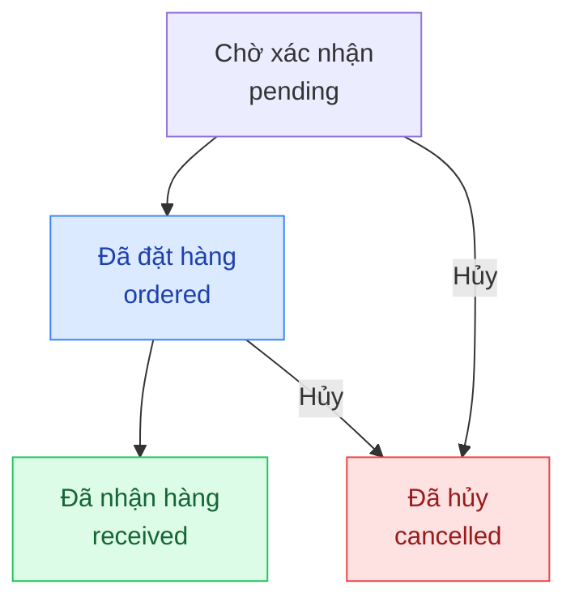

## Mô tả

Trang Nhập hàng quản lý các đơn mua hàng từ nhà cung cấp. Xác nhận nhận hàng sẽ cập nhật tồn kho tự động.

## Cách truy cập

Menu bên trái → **Nhập hàng**.

## Vòng đời đơn nhập hàng

| Trạng thái | Ý nghĩa |
|-----------|---------|
| `pending` — Chờ xác nhận | Đơn vừa tạo, chưa gửi cho nhà cung cấp |
| `ordered` — Đã đặt hàng | Đã xác nhận đặt hàng với nhà cung cấp, đang chờ hàng về |
| `received` — Đã nhận hàng | Hàng đã về kho, tồn kho và giá vốn đã được cập nhật |
| `cancelled` — Đã hủy | Đơn nhập bị hủy |

## Các thao tác chính

<Steps>
  <Step title="Tạo đơn nhập hàng">
    Nhấn **Tạo đơn nhập** → chọn nhà cung cấp → thêm sản phẩm, số lượng, giá vốn → **Lưu**.
    Đơn được tạo ở trạng thái **Chờ xác nhận**.
  </Step>
  <Step title="Xác nhận đã đặt hàng với nhà cung cấp">
    Sau khi liên hệ nhà cung cấp, mở đơn nhập → nhấn **Xác nhận đặt hàng**.
    Trạng thái chuyển sang **Đã đặt hàng** — hệ thống ghi lại ngày đặt.
  </Step>
  <Step title="Xác nhận nhận hàng">
    Khi hàng về kho, mở đơn nhập → nhấn **Xác nhận nhận hàng** để cập nhật tồn kho tự động.
  </Step>
  <Step title="Theo dõi trạng thái đơn nhập">
    Danh sách đơn nhập hiển thị trạng thái, nhà cung cấp và tổng giá trị từng đơn.
  </Step>
</Steps>

### Hủy đơn nhập

Đơn ở trạng thái `pending` hoặc `ordered` có thể hủy. Đơn đã `received` không thể hủy vì tồn kho đã được cập nhật.

<Note>
Giá vốn nhập trong đơn nhập hàng sẽ được ghi vào lịch sử giá vốn sản phẩm, ảnh hưởng đến tính toán lợi nhuận của các đơn hàng tiếp theo.
</Note>
