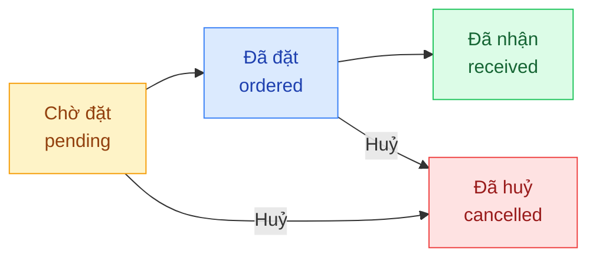

## Mô tả

Trang **Đơn nhập hàng** quản lý các đơn mua hàng (purchase orders) từ nhà cung cấp về kho. Quản lý có **toàn quyền** với chức năng này như Chủ shop. Khi đơn nhập chuyển sang **Đã nhận**, **Tồn vật lý** của biến thể tương ứng được cộng tự động.

## Cách truy cập

Menu bên trái → **Đơn nhập hàng** (mục **Kho vận**).

## Vòng đời đơn nhập

| Trạng thái | Nhãn | Ý nghĩa |
|-----------|------|---------|
| `pending` | **Chờ đặt** | Đơn vừa tạo, chưa liên hệ NCC |
| `ordered` | **Đã đặt** | Đã đặt với NCC, chờ về |
| `received` | **Đã nhận** | Hàng đã về — tồn vật lý cộng tự động |
| `cancelled` | **Đã huỷ** | Đơn đã huỷ |

<Note>
Việc chuyển trạng thái hiện qua API quản trị. Trang admin chỉ hiển thị trạng thái dạng đọc và cho phép lọc — chưa có nút chuyển trạng thái trong giao diện.
</Note>

## Bộ lọc và thao tác

| Thành phần | Mô tả |
|-----------|-------|
| **Tìm theo SKU, sản phẩm, ghi chú...** | Ô tìm kiếm, debounce 300ms |
| **Trạng thái** | Tất cả · Chờ đặt · Đã đặt · Đã nhận · Đã huỷ |
| **Tạo đơn nhập** | Mở dialog tạo đơn |

## Cột bảng

| Cột | Nội dung |
|-----|---------|
| **Sản phẩm** | Tên SP + tên biến thể |
| **SKU** | Mã SKU |
| **SL** | Số lượng đặt nhập |
| **Trạng thái** | Pill màu |
| **Ngày dự kiến** | Ngày dự kiến nhận |
| **Ngày tạo** | Ngày tạo đơn |

## Tạo đơn nhập

<Steps>
  <Step title="Mở dialog">
    Nhấn **Tạo đơn nhập** → dialog **Tạo đơn nhập hàng** mở ra.
  </Step>
  <Step title="Chọn biến thể">
    Dropdown **Sản phẩm** liệt kê tất cả biến thể: **Tên SP — Tên biến thể (SKU)**.
  </Step>
  <Step title="Số lượng + ngày dự kiến + ghi chú">
    | Trường | Bắt buộc | Mặc định |
    |--------|---------|---------|
    | **Số lượng** | Có (≥ 1) | 1 |
    | **Ngày dự kiến** | Không | (trống) |
    | **Ghi chú** | Không | (trống) |
  </Step>
  <Step title="Lưu">
    Nhấn **Tạo đơn**. Đơn xuất hiện ở trạng thái **Chờ đặt**.
  </Step>
</Steps>

<Warning>
Form **không có ô Nhà cung cấp** và **không có ô Giá vốn**. Việc gắn NCC mặc định và cập nhật giá vốn xử lý ở trang **Sản phẩm**.
</Warning>

## Ảnh hưởng đến tồn kho

- `pending` / `ordered`: **không** ảnh hưởng tồn kho.
- `received`: **Tồn vật lý** (`onHand`) cộng đúng bằng số lượng đã đặt.
- `cancelled`: không thay đổi tồn kho.
