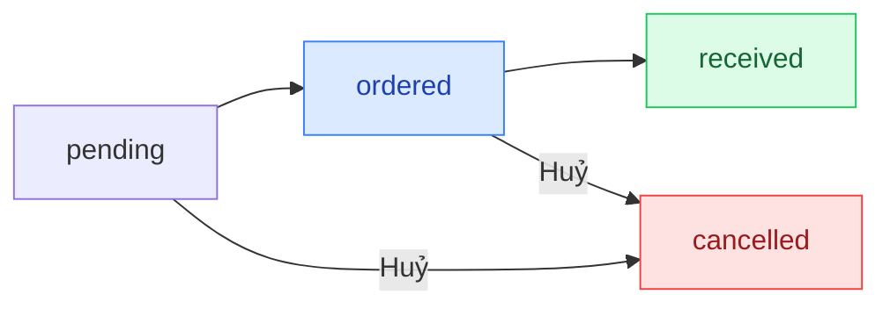

## Mô tả

Trang **Nhập hàng** quản lý đơn mua hàng từ nhà cung cấp. Khi xác nhận nhận hàng, tồn kho và giá vốn được cập nhật tự động.

## Cách truy cập

Truy cập qua **Quản lý kho** (Menu bên trái → **Kho vận** → **Quản lý kho**) → nhấn **Tạo đơn nhập** hoặc mở tab quản lý đơn nhập.

## Vòng đời đơn nhập hàng

### Mô tả các trạng thái

| Trạng thái | Ý nghĩa |
|-----------|---------|
| `pending` | Vừa tạo, chưa gửi NCC |
| `ordered` | Đã đặt hàng, chờ về |
| `received` | Đã về kho — tồn và giá vốn cập nhật |
| `cancelled` | Đã huỷ |

## Các thao tác chính

<Steps>
  <Step title="Tạo đơn nhập">
    **Tạo đơn nhập** → chọn NCC → chọn biến thể → nhập số lượng, giá vốn, ngày dự kiến → **Lưu**. Đơn ở trạng thái `pending`.
  </Step>
  <Step title="Xác nhận đặt hàng với NCC">
    Sau khi liên hệ NCC, mở đơn → **Xác nhận đặt hàng** → chuyển sang `ordered`.
  </Step>
  <Step title="Xác nhận nhận hàng">
    Khi hàng về, mở đơn → **Xác nhận nhận hàng**. Tồn kho cộng vào số đã có và giá vốn được lưu vào lịch sử.
  </Step>
  <Step title="Huỷ đơn">
    Đơn `pending` hoặc `ordered` có thể huỷ. Đơn `received` thì không.
  </Step>
</Steps>

<Note>
Giá vốn nhập ảnh hưởng trực tiếp đến lợi nhuận. Nhập đúng giá vốn thực tế khi tạo đơn.
</Note>
