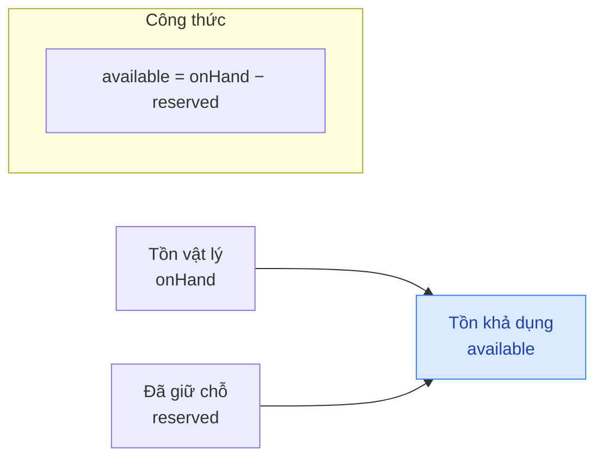
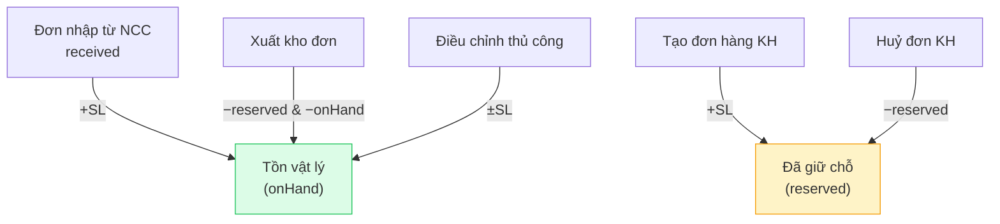

## Mô tả

Trang **Quản lý kho** cung cấp cái nhìn tổng thể về tồn kho — từng biến thể (SKU) của sản phẩm với 3 chỉ số: **Tồn vật lý**, **Đã giữ chỗ**, **Tồn khả dụng**. Trang cảnh báo các SKU sắp hết hoặc hết hàng để bạn lên kế hoạch nhập hàng kịp thời.

## Cách truy cập

Menu bên trái → **Quản lý kho** (mục **Kho vận**).

## Khái niệm tồn kho

| Cột | Công thức / nguồn | Ý nghĩa |
|-----|-------------------|---------|
| **Tồn vật lý** (`onHand`) | Số liệu kho thực tế | Số đơn vị thực tế đang trong kho |
| **Đã giữ chỗ** (`reserved`) | Tổng SL trong các đơn chưa giao | Hàng đã bán/đặt nhưng chưa xuất kho |
| **Tồn khả dụng** (`available`) | `onHand − reserved` | Số có thể bán cho đơn mới |

## Dòng chảy tồn kho

## Cảnh báo nhanh

Banner đỏ ở đầu trang xuất hiện khi có SP sắp hết hoặc hết hàng:

> **N SP sắp hết** · **M SP đã hết hàng**

## Thẻ thống kê

| Thẻ | Nguồn dữ liệu |
|-----|---------------|
| **Tổng SKU** | Tổng biến thể đang quản lý |
| **Còn hàng** | Tổng SKU − Sắp hết − Hết hàng |
| **Sắp hết** | SKU có `onHand` < `minLowStockThreshold` |
| **Hết hàng** | SKU có `onHand` = 0 |

## Tab dữ liệu

Trang có 3 tab — chuyển bằng FilterTabs ở đầu bảng.

### Tab "Tồn kho"

Hiển thị toàn bộ sản phẩm (50 SP đầu, theo phân trang sản phẩm).

| Cột | Nội dung |
|-----|---------|
| **Sản phẩm** | Thumbnail + tên (cắt 40 ký tự) |
| **Danh mục** | Pill màu danh mục (nếu có) |
| **Tồn khả dụng** | Số khả dụng — đỏ khi = 0, vàng khi dưới ngưỡng |
| **Tồn vật lý** | `onHand` — số thực tế |
| **Đã giữ chỗ** | `reserved` — số trong đơn chưa giao |

### Tab "Sắp hết"

Chỉ liệt kê biến thể có `onHand` dưới ngưỡng cảnh báo nhưng > 0.

| Cột | Nội dung |
|-----|---------|
| **Sản phẩm / SKU** | Tên SP + tên biến thể + SKU |
| **Tồn** | `onHand` (chữ vàng đậm) |
| **Tình trạng** | Pill **Sắp hết** (vàng) |

### Tab "Hết hàng"

Liệt kê biến thể có `onHand` = 0.

| Cột | Nội dung |
|-----|---------|
| **Sản phẩm / SKU** | Tên SP + biến thể + SKU |
| **Tồn** | 0 (chữ đỏ đậm) |
| **Tình trạng** | Pill **Hết hàng** (đỏ) |

## Các thao tác chính

<Steps>
  <Step title="Kiểm tra cảnh báo hàng ngày">
    Mở **Quản lý kho** → đọc banner đỏ ở đầu trang để biết số SKU sắp/hết hàng.
  </Step>
  <Step title="Xem chi tiết SKU sắp hết">
    Nhấn tab **Sắp hết** → bảng hiển thị từng biến thể cụ thể (SKU, tên SP, số tồn còn lại) để lên kế hoạch nhập.
  </Step>
  <Step title="Xem chi tiết SKU đã hết">
    Nhấn tab **Hết hàng** → các SKU cần nhập gấp.
  </Step>
  <Step title="Tạo đơn nhập từ cảnh báo">
    Sang trang **Đơn nhập hàng** → **Tạo đơn nhập** → chọn biến thể tương ứng → nhập số lượng cần nhập.
  </Step>
</Steps>

## Ngưỡng cảnh báo

| Tham số | Mặc định | Cách thay đổi |
|---------|----------|---------------|
| `minLowStockThreshold` | **30** đơn vị | Trang **Sản phẩm** → mở chi tiết sản phẩm → cập nhật ngưỡng phù hợp tốc độ bán |

<Note>
Tồn kho tự động giảm khi đơn hàng được tạo (số chuyển sang **Đã giữ chỗ**) và quay về kho khi đơn bị huỷ. Đơn nhập từ NCC cộng vào **Tồn vật lý** sau khi xác nhận **Đã nhận**.
</Note>

<Warning>
Nút **Điều chỉnh kho** ở góc phải tab hiện chưa có chức năng — đang phát triển. Việc điều chỉnh thủ công (kiểm kê, hao hụt) hiện chưa khả dụng từ giao diện.
</Warning>
