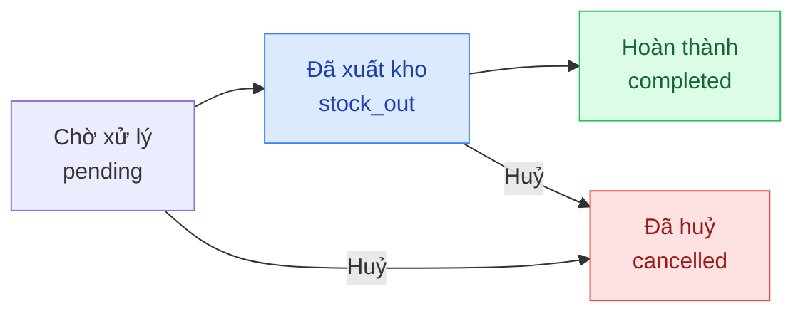

## Mô tả

Trang Đơn hàng là trung tâm xử lý mọi đơn hàng. Mỗi đơn có **2 trạng thái song song**:

- **Trạng thái thanh toán** (`paymentStatus`): theo dõi tiền đã thu.
- **Trạng thái xử lý** (`fulfillmentStatus`): theo dõi giao hàng / hoàn thành.

## Cách truy cập

Menu bên trái → **Đơn hàng**.

## Trạng thái đơn hàng

### Trạng thái thanh toán

| Mã | Hiển thị | Ý nghĩa |
|----|---------|---------|
| `unpaid` | Chưa thanh toán | Khách chưa trả đồng nào |
| `partial` | Thanh toán một phần | Đã thu một phần, vẫn còn nợ |
| `paid` | Đã thanh toán | Đã thu đủ |

### Trạng thái xử lý (fulfillment)

| Mã | Hiển thị | Ý nghĩa |
|----|---------|---------|
| `pending` | Chờ xử lý | Đơn vừa tạo, chưa xuất kho |
| `stock_out` | Đã xuất kho | Hàng đã được lấy ra để giao cho khách |
| `completed` | Hoàn thành | Khách đã nhận hàng |
| `cancelled` | Đã huỷ | Đơn bị huỷ |

### Vòng đời chuẩn

<Note>
**Tồn kho**: Số lượng tồn kho được giữ chỗ (`reserved`) ngay khi đơn được tạo, và chuyển thành xuất kho khi trạng thái sang `stock_out`. Khi đơn bị huỷ, số đã giữ chỗ được trả về kho.
</Note>

## Trang danh sách

### Tab lọc nhanh

Thanh tab phía trên bảng:

- **Tất cả**
- **Chờ xử lý** (`pending`)
- **Đã xuất kho** (`stock_out`)
- **Hoàn thành** (`completed`)
- **Đã huỷ** (`cancelled`)

### Tìm kiếm

Ô **Tìm mã đơn, khách hàng...** ở góc phải lọc theo mã đơn, tên hoặc số điện thoại khách. Debounce 300ms.

### Hành động trên thanh công cụ

- **Xuất Excel** — xuất danh sách đang lọc ra file Excel.
- **Tạo đơn** — chuyển đến `/orders/new` để tạo đơn thủ công cho khách.

### Bảng đơn hàng

| Cột | Nội dung |
|-----|---------|
| **Mã đơn** | Mã đơn hàng (font monospace) |
| **Khách hàng** | Tên đầy đủ |
| **SĐT** | Số điện thoại |
| **Số lượng** | Số món trong đơn |
| **Tổng tiền** | Tổng tiền (in đỏ) |
| **Thanh toán** | Badge: Chưa TT / Một phần / Đã TT |
| **Trạng thái** | Badge fulfillment |
| **Thời gian** | Ngày giờ tạo đơn |
| **Chi tiết** | Mở trang chi tiết đơn |

Nhấn vào hàng đơn hoặc nút **Chi tiết** để mở trang chi tiết.

### Phân trang

Cuối bảng có dropdown **10 / 25 / 50 / 100** mỗi trang. Mặc định 25.

## Tạo đơn hàng thủ công (`/orders/new`)

Form tạo đơn được chia 2 cột: **trái** chứa khách hàng & sản phẩm, **phải** chứa ghi chú, địa chỉ giao, phí ship và tổng quan.

### Cột trái

#### Thông tin khách hàng (`CustomerSelector`)

<Steps>
  <Step title="Tìm khách hàng có sẵn">
    Gõ tên / SĐT / mã KH vào ô tìm kiếm — kết quả debounce 300ms. Nhấn vào khách trong danh sách để chọn.
  </Step>
  <Step title="Hoặc tạo khách mới ngay tại form">
    Chọn tab **Khách mới** → nhập **Tên** và **SĐT** (Tên bắt buộc). Khách sẽ được tạo cùng đơn hàng.
  </Step>
</Steps>

<Note>
Hai trường khách: chỉ chọn 1 trong 2 — chọn khách có sẵn sẽ huỷ khách mới và ngược lại.
</Note>

#### Sản phẩm (`ProductSelector` + `OrderItemsTable`)

<Steps>
  <Step title="Tìm và chọn biến thể">
    Ô tìm kiếm sản phẩm → chọn biến thể → tự động thêm vào bảng dưới với SL = 1.
  </Step>
  <Step title="Chỉnh số lượng / giá">
    Trong bảng đơn: thay đổi SL (số nguyên ≥ 1), giá tuỳ biến (`customPrice`) hoặc xoá dòng bằng nút thùng rác.
  </Step>
  <Step title="Thêm tiếp">
    Mỗi lần chọn lại biến thể đã có trong giỏ → SL tự +1.
  </Step>
</Steps>

### Cột phải

| Thẻ | Mô tả |
|-----|------|
| **Ghi chú đơn hàng** | Textarea — ghi chú nội bộ cho đơn |
| **Địa chỉ giao hàng** | 3 trường: Người nhận, SĐT nhận hàng, Địa chỉ (textarea). Tất cả tuỳ chọn — nếu trống dùng địa chỉ trong hồ sơ khách |
| **Phí ship** | Switch **Trả phí ship hộ khách** + ô nhập số tiền (chỉ hiện khi switch ON). Cộng vào tổng đơn |
| **Tổng quan** | Tạm tính · Phí ship trả hộ · **Tổng cộng** + nút **Tạo đơn hàng** |

### Validate khi lưu

- Phải chọn khách (có sẵn hoặc khách mới có **Tên**).
- Phải có ít nhất 1 sản phẩm.

Nếu hợp lệ — đơn được tạo ở trạng thái `pending` / `unpaid`, redirect đến `/orders/{id}`.

## Trang chi tiết đơn hàng

### Ghi nhận thanh toán

<Steps>
  <Step title="Mở hộp thoại thanh toán">
    Nhấn nút **Thanh toán** ở góc phải tiêu đề trang.
  </Step>
  <Step title="Nhập thông tin thanh toán">
    - **Số tiền thanh toán** — tối đa bằng số còn nợ.
    - **Phương thức** — Tiền mặt / Chuyển khoản / Thẻ.
    - **Mã tham chiếu** — chỉ hiển thị khi chọn Chuyển khoản.
    - **Ghi chú** — nội bộ, tùy chọn.
  </Step>
  <Step title="Lưu thanh toán">
    Nhấn **Lưu thanh toán**. Mỗi lần thu tiền là một dòng trong **Lịch sử thanh toán**.
    Khi đủ tiền, `paymentStatus` chuyển thành `paid`.
  </Step>
</Steps>

<Note>
Đơn hỗ trợ thanh toán nhiều lần. Trạng thái `partial` xuất hiện khi đã thu nhưng chưa đủ.
</Note>

### Cập nhật trạng thái xử lý

Nút hành động ở góc phải tiêu đề thay đổi theo trạng thái hiện tại:

| Trạng thái hiện tại | Nút khả dụng |
|---------------------|---------------|
| `pending` — Chờ xử lý | **Xuất kho** · **Huỷ đơn** · **Thanh toán** (nếu chưa thu đủ) |
| `stock_out` — Đã xuất kho | **Hoàn tất đơn** (nếu đã thu đủ) · **Thanh toán** (nếu chưa thu đủ) |
| `completed` — Hoàn thành | *(trạng thái cuối)* |
| `cancelled` — Đã huỷ | **Xoá đơn hàng** (cột phải) |

<Steps>
  <Step title="Thêm ghi chú cập nhật (tùy chọn)">
    Phần **Ghi chú cập nhật** — nhập lý do (ví dụ: "Khách đổi địa chỉ"). Lưu vào dòng thời gian **Lịch sử trạng thái**.
  </Step>
  <Step title="Nhấn nút hành động">
    Hộp thoại xác nhận → **OK** để xác nhận chuyển trạng thái.
  </Step>
</Steps>

### Lịch sử trạng thái

Phần **Lịch sử trạng thái** là dòng thời gian các lần chuyển trạng thái:

- Tên trạng thái + thời điểm.
- Người thực hiện cập nhật.
- Ghi chú kèm theo (nếu có).

### Chỉnh sửa ghi chú và giảm giá

<Steps>
  <Step title="Mở chế độ chỉnh sửa">
    Cột thông tin bên phải → nhấn **Chỉnh sửa**.
  </Step>
  <Step title="Cập nhật">
    - **Ghi chú admin** — nội bộ, không hiển thị cho khách.
    - **Giảm giá (VND)** — số tiền chiết khấu.
  </Step>
  <Step title="Lưu">
    Nhấn **Lưu**.
  </Step>
</Steps>

### Sửa danh sách sản phẩm trong đơn

Chỉ khả dụng khi đơn ở trạng thái `pending` **và** không phải đơn cha/con đã tách:

<Steps>
  <Step title="Mở chế độ sửa">
    Nhấn nút **Sửa** trong thẻ "Chi tiết sản phẩm".
  </Step>
  <Step title="Thêm / xoá / chỉnh sản phẩm">
    Dùng selector để thêm biến thể, hoặc thay đổi SL / đơn giá / xoá dòng trực tiếp trong bảng.
  </Step>
  <Step title="Lưu">
    Nhấn **Lưu** — hệ thống tính lại tổng tiền, cập nhật tồn kho `reserved`.
  </Step>
</Steps>

### Xuất hoá đơn

Nhấn dropdown **Xuất hoá đơn** ở góc phải tiêu đề — 3 lựa chọn:

| Tuỳ chọn | Hành động |
|----------|----------|
| **Sao chép** | Copy ảnh hoá đơn vào clipboard (paste vào Zalo, Messenger...) |
| **Xuất file ảnh** | Tải xuống file PNG hoá đơn |
| **Xuất file PDF** | Tải xuống file PDF (in trực tiếp) |

Thông tin cửa hàng (tên, địa chỉ, MST, logo) lấy từ **Cài đặt → Cửa hàng**.

### Ghi nhận thanh toán nhiều lần

Phần **Lịch sử thanh toán** hiển thị bảng các lần thu tiền:

| Cột | Nội dung |
|-----|---------|
| **Thời gian** | Thời điểm ghi nhận |
| **Phương thức** | Tiền mặt / Chuyển khoản / Thẻ |
| **Ghi chú/Mã** | Mã GD (nếu chuyển khoản) + ghi chú nội bộ |
| **Số tiền** | Số tiền lần thu (in xanh) |
| **Người thu** | Nhân viên ghi nhận |

### Xoá đơn hàng

Chỉ có thể xoá đơn ở trạng thái **Đã huỷ** (`cancelled`). Nút **Xoá** xuất hiện ở cuối cột phải sau khi huỷ.

<Warning>
Xoá đơn là thao tác **không thể hoàn tác**. Toàn bộ lịch sử đơn sẽ mất vĩnh viễn.
</Warning>

## Đơn hàng tách (Split Orders)

Khi khách chọn **Giao hàng khi có hàng** lúc đặt và đơn có cả hàng có sẵn lẫn hàng đặt trước, hệ thống tự động tách đơn gốc thành các đơn con theo loại tồn:

- **Đơn con A** (suffix `A`) — hàng có sẵn (`in_stock`).
- **Đơn con B** (suffix `B`) — hàng đặt trước (`pre_order`).

Mỗi đơn con có trạng thái riêng và được xử lý độc lập:

- Đơn con hiển thị banner _"Đơn hàng được tách từ đơn gốc"_ kèm link về đơn gốc.
- Đơn gốc hiển thị danh sách đơn con với loại hàng và trạng thái riêng.
