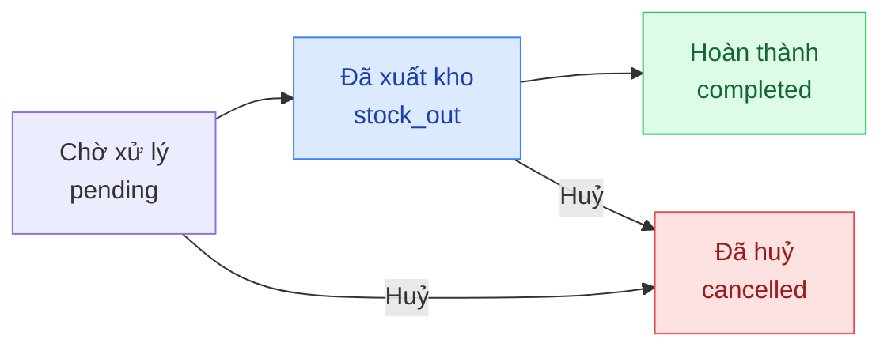

## Mô tả

Trang Đơn hàng là trung tâm xử lý mọi đơn hàng. Mỗi đơn có **2 trạng thái song song**:

- **Trạng thái thanh toán** (`paymentStatus`): theo dõi tiền đã thu.
- **Trạng thái xử lý** (`fulfillmentStatus`): theo dõi giao hàng / hoàn thành.

## Cách truy cập

Menu bên trái → **Đơn hàng**.

## Trạng thái đơn hàng

### Trạng thái thanh toán

| Mã | Hiển thị | Ý nghĩa |
|----|---------|---------|
| `unpaid` | Chưa thanh toán | Khách chưa trả đồng nào |
| `partial` | Thanh toán một phần | Đã thu một phần, vẫn còn nợ |
| `paid` | Đã thanh toán | Đã thu đủ |

### Trạng thái xử lý (fulfillment)

| Mã | Hiển thị | Ý nghĩa |
|----|---------|---------|
| `pending` | Chờ xử lý | Đơn vừa tạo, chưa xuất kho |
| `stock_out` | Đã xuất kho | Hàng đã được lấy ra để giao cho khách |
| `completed` | Hoàn thành | Khách đã nhận hàng |
| `cancelled` | Đã huỷ | Đơn bị huỷ |

### Vòng đời chuẩn

<Note>
**Tồn kho**: Số lượng tồn kho được giữ chỗ (`reserved`) ngay khi đơn được tạo, và chuyển thành xuất kho khi trạng thái sang `stock_out`. Khi đơn bị huỷ, số đã giữ chỗ được trả về kho.
</Note>

## Trang danh sách

### Tab lọc nhanh

Thanh tab phía trên bảng:

- **Tất cả**
- **Chờ xử lý** (`pending`)
- **Đã xuất kho** (`stock_out`)
- **Hoàn thành** (`completed`)
- **Đã huỷ** (`cancelled`)

### Tìm kiếm

Ô **Tìm mã đơn, khách hàng...** ở góc phải lọc theo mã đơn, tên hoặc số điện thoại khách. Debounce 300ms.

### Hành động trên thanh công cụ

- **Xuất Excel** — xuất danh sách đang lọc ra file Excel.
- **Tạo đơn** — chuyển đến `/orders/new` để tạo đơn thủ công cho khách.

### Bảng đơn hàng

| Cột | Nội dung |
|-----|---------|
| **Mã đơn** | Mã đơn hàng (font monospace) |
| **Khách hàng** | Tên đầy đủ |
| **SĐT** | Số điện thoại |
| **Số lượng** | Số món trong đơn |
| **Tổng tiền** | Tổng tiền (in đỏ) |
| **Thanh toán** | Badge: Chưa TT / Một phần / Đã TT |
| **Trạng thái** | Badge fulfillment |
| **Thời gian** | Ngày giờ tạo đơn |
| **Chi tiết** | Mở trang chi tiết đơn |

Nhấn vào hàng đơn hoặc nút **Chi tiết** để mở trang chi tiết.

### Phân trang

Cuối bảng có dropdown **10 / 25 / 50 / 100** mỗi trang. Mặc định 25.

## Tạo đơn hàng thủ công

<Steps>
  <Step title="Mở form tạo đơn">
    Nhấn **Tạo đơn** ở thanh công cụ → mở trang `/orders/new`.
  </Step>
  <Step title="Chọn khách hàng">
    Tìm khách hàng theo tên/SĐT hoặc tạo khách mới ngay tại form.
  </Step>
  <Step title="Thêm sản phẩm">
    Tìm sản phẩm và thêm biến thể vào giỏ. Số lượng có thể chỉnh trực tiếp.
  </Step>
  <Step title="Cấu hình giao hàng và giảm giá">
    Nhập địa chỉ giao, ghi chú, giảm giá (nếu có).
  </Step>
  <Step title="Lưu đơn">
    Nhấn **Lưu** — đơn được tạo ở trạng thái `pending` / `unpaid`.
  </Step>
</Steps>

## Trang chi tiết đơn hàng

### Ghi nhận thanh toán

<Steps>
  <Step title="Mở hộp thoại thanh toán">
    Nhấn nút **Thanh toán** ở góc phải tiêu đề trang.
  </Step>
  <Step title="Nhập thông tin thanh toán">
    - **Số tiền thanh toán** — tối đa bằng số còn nợ.
    - **Phương thức** — Tiền mặt / Chuyển khoản / Thẻ.
    - **Mã tham chiếu** — chỉ hiển thị khi chọn Chuyển khoản.
    - **Ghi chú** — nội bộ, tùy chọn.
  </Step>
  <Step title="Lưu thanh toán">
    Nhấn **Lưu thanh toán**. Mỗi lần thu tiền là một dòng trong **Lịch sử thanh toán**.
    Khi đủ tiền, `paymentStatus` chuyển thành `paid`.
  </Step>
</Steps>

<Note>
Đơn hỗ trợ thanh toán nhiều lần. Trạng thái `partial` xuất hiện khi đã thu nhưng chưa đủ.
</Note>

### Cập nhật trạng thái xử lý

Nút hành động ở góc phải tiêu đề thay đổi theo trạng thái hiện tại:

| Trạng thái hiện tại | Nút khả dụng |
|---------------------|---------------|
| `pending` — Chờ xử lý | **Đánh dấu xuất kho** · **Huỷ đơn** |
| `stock_out` — Đã xuất kho | **Đánh dấu hoàn thành** · **Huỷ đơn** |
| `completed` — Hoàn thành | *(trạng thái cuối)* |
| `cancelled` — Đã huỷ | *(trạng thái cuối)* |

<Steps>
  <Step title="Thêm ghi chú cập nhật (tùy chọn)">
    Phần **Ghi chú cập nhật** — nhập lý do (ví dụ: "Khách đổi địa chỉ"). Lưu vào dòng thời gian **Lịch sử trạng thái**.
  </Step>
  <Step title="Nhấn nút hành động">
    Hộp thoại xác nhận → **OK** để xác nhận chuyển trạng thái.
  </Step>
</Steps>

### Lịch sử trạng thái

Phần **Lịch sử trạng thái** là dòng thời gian các lần chuyển trạng thái:

- Tên trạng thái + thời điểm.
- Người thực hiện cập nhật.
- Ghi chú kèm theo (nếu có).

### Chỉnh sửa ghi chú và giảm giá

<Steps>
  <Step title="Mở chế độ chỉnh sửa">
    Cột thông tin bên phải → nhấn **Chỉnh sửa**.
  </Step>
  <Step title="Cập nhật">
    - **Ghi chú admin** — nội bộ, không hiển thị cho khách.
    - **Giảm giá (VND)** — số tiền chiết khấu.
  </Step>
  <Step title="Lưu">
    Nhấn **Lưu**.
  </Step>
</Steps>

### In hoá đơn

Nhấn **In hoá đơn** ở góc phải tiêu đề để in/xuất PDF. Thông tin cửa hàng (tên, địa chỉ, MST) lấy từ **Cài đặt → Cửa hàng**.

### Xoá đơn hàng

Chỉ có thể xoá đơn ở trạng thái **Đã huỷ** (`cancelled`). Nút **Xoá** xuất hiện ở cuối cột phải sau khi huỷ.

<Warning>
Xoá đơn là thao tác **không thể hoàn tác**. Toàn bộ lịch sử đơn sẽ mất vĩnh viễn.
</Warning>

## Đơn hàng tách (Split Orders)

Khi khách chọn **Giao hàng khi có hàng** lúc đặt và đơn có cả hàng có sẵn lẫn hàng đặt trước, hệ thống tự động tách đơn gốc thành các đơn con theo loại tồn:

- **Đơn con A** (suffix `A`) — hàng có sẵn (`in_stock`).
- **Đơn con B** (suffix `B`) — hàng đặt trước (`pre_order`).

Mỗi đơn con có trạng thái riêng và được xử lý độc lập:

- Đơn con hiển thị banner _"Đơn hàng được tách từ đơn gốc"_ kèm link về đơn gốc.
- Đơn gốc hiển thị danh sách đơn con với loại hàng và trạng thái riêng.
