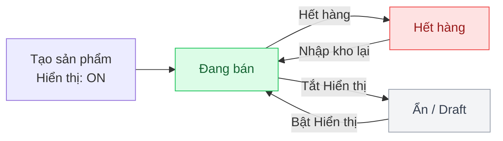

## Mô tả

Trang **Sản phẩm** là trung tâm quản lý mọi mặt hàng trong cửa hàng. Một sản phẩm có thể có nhiều **biến thể** (ví dụ: cùng áo nhưng khác màu/size). Mỗi biến thể có giá bán, giá vốn, tồn kho và hình ảnh riêng.

## Cách truy cập

Menu bên trái → **Sản phẩm**.

## Trang danh sách

### Bộ lọc nhanh (tab)

Thanh tab phía trên bảng:

| Tab | Lọc theo |
|-----|----------|
| **Tất cả** | Mọi sản phẩm |
| **Còn hàng** | `totalAvailable > ngưỡng cảnh báo` |
| **Sắp hết** | `0 < totalAvailable ≤ ngưỡng cảnh báo` |
| **Hết hàng** | `totalAvailable = 0` |

### Tìm kiếm

Ô **Tìm tên, mã SP...** lọc theo tên sản phẩm hoặc SKU. Debounce 300ms.

### Cột bảng danh sách

| Cột | Nội dung |
|-----|---------|
| **Sản phẩm** | Thumbnail + tên + SKU/slug |
| **Danh mục** | Danh mục cha (badge tone indigo) |
| **Giá bán** | Giá hoặc khoảng giá `min – max` (in đỏ) |
| **Tồn kho** | Tổng tồn (màu đỏ nếu = 0, vàng nếu < ngưỡng cảnh báo) |
| **Trạng thái** | Badge: Đang bán / Hết hàng / Ẩn |
| **Sửa** | Nút mở drawer chỉnh sửa nhanh |

Nhấn vào hàng sản phẩm hoặc nút **Sửa** để mở drawer chỉnh sửa sản phẩm cùng các biến thể.

### Phân trang

Cuối bảng — dropdown **10 / 20 / 50 / 100** mỗi trang. Mặc định **20**.

## Thêm sản phẩm mới

<Steps>
  <Step title="Mở form">
    Nhấn nút **Thêm sản phẩm** ở góc trên phải → mở trang `/products/new`.
  </Step>
  <Step title="Tab Thông tin chung">
    Điền các trường cơ bản (xem bảng dưới).
  </Step>
  <Step title="Tab Biến thể & Giá">
    Tạo biến thể tự động bằng bộ tạo, hoặc thêm thủ công.
  </Step>
  <Step title="Tab Hình ảnh">
    Upload ảnh cho từng biến thể.
  </Step>
  <Step title="Lưu">
    Nhấn **Tạo sản phẩm** ở cột phải. Hệ thống tự sinh slug và mã SKU theo định dạng đã cấu hình.
  </Step>
</Steps>

### Tab 1: Thông tin chung

| Trường | Bắt buộc | Mô tả |
|--------|---------|------|
| **Tên sản phẩm** | Có | Tên hiển thị trên storefront |
| **Danh mục** | Không | Cây danh mục đa cấp — chọn 1 danh mục lá |
| **Giá niêm yết (Base Price)** | Không | Giá mặc định cho biến thể tạo mới (VND) |
| **Mô tả sản phẩm** | Không | Textarea — mô tả chi tiết, hiển thị trên storefront |
| **Hiển thị sản phẩm** | — | Switch ON/OFF → ẩn/hiện trên storefront. Mặc định `ON` |
| **Bán chạy / Nổi bật** | — | Switch — sản phẩm vào mục "Sản phẩm được yêu thích" trên trang chủ |

### Tab 2: Biến thể & Giá

#### Bộ tạo biến thể tự động

Cho phép sinh nhanh các biến thể từ thuộc tính:

<Steps>
  <Step title="Nhập giá trị Thuộc tính 1 (Color)">
    Ví dụ: `Đỏ, Xanh, Đen` (phân tách bằng dấu phẩy).
  </Step>
  <Step title="Nhập giá trị Thuộc tính 2 (Size)">
    Ví dụ: `S, M, L, XL`.
  </Step>
  <Step title="Tạo danh sách biến thể">
    Nhấn **Tạo danh sách biến thể** — hệ thống sinh tích Descartes. 3 màu × 4 size → 12 biến thể (`Đỏ - S`, `Đỏ - M`, ...). SKU tự động sinh từ tên + thuộc tính.
  </Step>
</Steps>

<Note>
Bộ tạo chỉ có 2 thuộc tính cố định: **Color** và **Size**. Nếu chỉ dùng 1 thuộc tính, để trống thuộc tính còn lại.
</Note>

#### Bảng biến thể

| Cột | Mô tả |
|-----|------|
| **#** | Số thứ tự |
| **Tên biến thể** | Ví dụ: `Đỏ - M` |
| **Mã SKU** | Mã định danh duy nhất (font monospace, nền xanh) |
| **Giá bán** | Giá bán cho biến thể (VND) |
| **Giá vốn** | Giá nhập (VND) — dùng để tính lợi nhuận |
| **Tồn kho** | Số lượng hiện có |
| **Ngưỡng cảnh báo** | Khi tồn kho ≤ ngưỡng → cảnh báo "Sắp hết". Mặc định `30` |
| **Xoá** | Nút thùng rác xoá dòng |

Nút **Thêm thủ công** ở góc trên phải bảng — thêm 1 dòng biến thể trắng.

### Tab 3: Hình ảnh

Quản lý ảnh **theo từng biến thể**:

<Steps>
  <Step title="Chọn biến thể">
    Dropdown **Chọn biến thể** ở đầu tab.
  </Step>
  <Step title="Upload ảnh">
    Vùng kéo-thả hoặc nhấn để chọn file. Tối đa **10 ảnh / biến thể**. Hỗ trợ JPG, PNG, WebP.
  </Step>
  <Step title="Thay đổi thứ tự">
    Ảnh đầu tiên là ảnh đại diện. Kéo-thả để sắp xếp lại.
  </Step>
</Steps>

## Chỉnh sửa sản phẩm

Có 2 cách:

- **Drawer nhanh** — Nhấn vào hàng sản phẩm trong bảng → drawer mở bên phải.
- **Trang chỉnh sửa đầy đủ** — Đường dẫn `/products/{id}/edit` (giao diện giống trang Tạo mới, đầy đủ tab).

## Vòng đời sản phẩm

## Đánh dấu sản phẩm nổi bật

Công tắc **Bán chạy / Nổi bật** quyết định sản phẩm có xuất hiện trong mục **"Sản phẩm được yêu thích"** trên trang chủ storefront.

<Steps>
  <Step title="Mở sản phẩm cần đánh dấu">
    Trong danh sách → nhấn vào hàng → drawer mở.
  </Step>
  <Step title="Bật công tắc">
    Tab **Thông tin chung** → switch **Bán chạy / Nổi bật** → gạt sang `ON`.
  </Step>
  <Step title="Lưu">
    Nhấn **Lưu thay đổi**. Sản phẩm xuất hiện ngay trên trang chủ.
  </Step>
</Steps>

<Warning>
Giá vốn ảnh hưởng trực tiếp đến báo cáo lợi nhuận. Hãy cập nhật giá vốn mỗi khi nhập hàng với giá mới (qua **Đơn nhập hàng** để tự động cập nhật theo bình quân gia quyền).
</Warning>

<Note>
Chỉ Chủ shop có quyền **xoá biến thể** đã có lịch sử bán hàng. Nhân viên không có quyền upload ảnh sản phẩm.
</Note>
