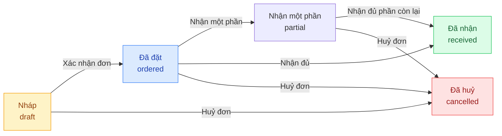

## Mô tả

Trang **Đặt hàng nhập** quản lý đơn đặt hàng nhập (Purchase Order — PO). Đây là bước đầu tiên trong quy trình nhập kho: tạo đơn → xác nhận → tạo phiếu nhập → thanh toán → hoàn tất.

## Cách truy cập

Menu bên trái → **Đặt hàng nhập** (mục **Kho vận**).

## Vòng đời đơn đặt hàng

| Trạng thái | Ý nghĩa |
|-----------|---------|
| **Nháp** | Đơn vừa tạo, chưa xác nhận với NCC |
| **Đã đặt** | Đã xác nhận, chờ hàng về — có thể tạo phiếu nhập |
| **Nhận một phần** | Đã có phiếu nhập hoàn tất nhưng chưa nhận đủ số lượng đặt |
| **Đã nhận** | Đã nhận đủ số lượng đặt |
| **Đã huỷ** | Đơn bị huỷ |

## Bộ lọc và tìm kiếm

| Thành phần | Mô tả |
|-----------|-------|
| Tab trạng thái | Tất cả · Nháp · Đã đặt · Đã nhận · Đã huỷ |
| Ô tìm kiếm | Tìm theo mã đơn, tên NCC |
| **Tạo đơn nhập** | Mở trang tạo đơn mới |

## Tạo đơn đặt hàng

<Steps>
  <Step title="Mở trang tạo đơn">
    Nhấn **Tạo đơn nhập** → chuyển đến `/purchases/new`.
  </Step>
  <Step title="Chọn nhà cung cấp và ngày dự kiến (tuỳ chọn)">
    | Trường | Bắt buộc |
    |--------|---------|
    | Nhà cung cấp | Không |
    | Ngày dự kiến nhập | Không |
  </Step>
  <Step title="Thêm sản phẩm">
    Dùng ô tìm kiếm để chọn biến thể. Mỗi lần chọn lại một biến thể đã có sẽ tăng số lượng thêm 1.

    | Cột | Bắt buộc |
    |-----|---------|
    | Số lượng | Có (≥ 1) |
    | Giá nhập (đ) | Có (≥ 0) |
    | Giảm giá (đ) | Không |
  </Step>
  <Step title="Lưu">
    Nhấn **Tạo đơn**. Đơn xuất hiện ở trạng thái **Nháp**.
  </Step>
</Steps>

## Thao tác trên đơn

### Xác nhận đơn

Chuyển trạng thái từ **Nháp** → **Đã đặt**. Sau khi xác nhận, có thể tạo phiếu nhập hàng.

<Steps>
  <Step title="Mở chi tiết đơn">
    Nhấn vào dòng đơn trong danh sách.
  </Step>
  <Step title="Xác nhận">
    Nhấn **Xác nhận đơn** ở góc trên phải.
  </Step>
</Steps>

### Tạo phiếu nhập từ đơn

Khi đơn ở trạng thái **Đã đặt** hoặc **Nhận một phần**, nút **Tạo phiếu nhập** xuất hiện. Hệ thống tự điền NCC, sản phẩm và giá nhập từ đơn vào phiếu.

<Steps>
  <Step title="Mở chi tiết đơn đã xác nhận">
    Đơn phải ở trạng thái **Đã đặt** hoặc **Nhận một phần**.
  </Step>
  <Step title="Nhấn Tạo phiếu nhập">
    Chuyển đến `/receipts/new` với dữ liệu được điền sẵn từ đơn.
  </Step>
  <Step title="Hoàn tất phiếu nhập">
    Xem hướng dẫn **Nhập hàng** để tiếp tục.
  </Step>
</Steps>

### Huỷ đơn

<Warning>
Có thể huỷ đơn khi chưa ở trạng thái **Đã nhận**. Đơn **Đã nhận** không thể huỷ.
</Warning>

## Cột bảng danh sách

| Cột | Nội dung |
|-----|---------|
| **Mã đơn** | Mã PO tự sinh |
| **Nhà cung cấp** | Tên NCC (nếu có) |
| **Tổng SL** | Tổng số lượng các dòng |
| **Giá trị** | Tổng thành tiền |
| **Trạng thái** | Pill màu |
| **Ngày tạo** | Thời gian tạo đơn |

<Note>
Tồn kho **chưa thay đổi** khi tạo hoặc xác nhận đơn. Tồn kho chỉ tăng sau khi **phiếu nhập được hoàn tất**.
</Note>
