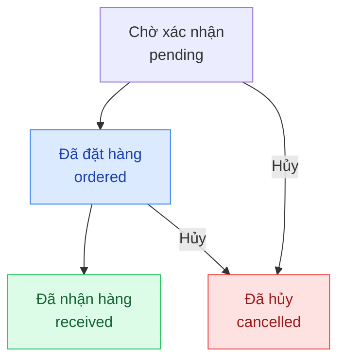

## Mô tả

Trang Nhập hàng dùng để tạo và theo dõi các đơn mua hàng từ nhà cung cấp. Sau khi xác nhận nhận hàng, tồn kho sản phẩm tương ứng được cập nhật tự động.

## Cách truy cập

Menu bên trái → **Nhập hàng**.

## Vòng đời đơn nhập hàng

### Mô tả các trạng thái

| Trạng thái | Ý nghĩa |
|-----------|---------|
| `pending` — Chờ xác nhận | Đơn vừa tạo, chưa gửi cho nhà cung cấp |
| `ordered` — Đã đặt hàng | Đã liên hệ và xác nhận đặt hàng với nhà cung cấp, đang chờ hàng về |
| `received` — Đã nhận hàng | Hàng đã về kho, tồn kho và giá vốn đã được cập nhật |
| `cancelled` — Đã hủy | Đơn nhập bị hủy |

## Các thao tác chính

<Steps>
  <Step title="Tạo đơn nhập hàng mới">
    Nhấn **Tạo đơn nhập** → chọn nhà cung cấp → thêm sản phẩm và số lượng cần nhập → nhập giá vốn thực tế → **Lưu**.
    Đơn được tạo ở trạng thái **Chờ xác nhận** (`pending`).
  </Step>
  <Step title="Xác nhận đã đặt hàng với nhà cung cấp">
    Sau khi liên hệ nhà cung cấp và xác nhận đơn hàng, mở đơn nhập → nhấn **Xác nhận đặt hàng**.
    Trạng thái chuyển sang **Đã đặt hàng** (`ordered`) — hệ thống ghi lại ngày đặt hàng.
  </Step>
  <Step title="Xác nhận nhận hàng">
    Khi hàng về kho, mở đơn nhập → nhấn **Xác nhận nhận hàng**.
    Tồn kho và lịch sử giá vốn sản phẩm được cập nhật ngay lập tức.
    Trạng thái chuyển sang **Đã nhận hàng** (`received`).
  </Step>
  <Step title="Theo dõi đơn nhập">
    Danh sách đơn nhập hiển thị trạng thái, nhà cung cấp, ngày tạo và tổng giá trị từng đơn.
    Lọc theo trạng thái để xem nhanh đơn đang chờ nhận hàng.
  </Step>
</Steps>

### Hủy đơn nhập

Đơn nhập ở trạng thái `pending` hoặc `ordered` có thể bị hủy. Mở đơn nhập → nhấn **Hủy đơn**. Đơn ở trạng thái `received` không thể hủy vì tồn kho đã được cập nhật.

<Note>
Giá vốn nhập trong đơn nhập hàng sẽ được ghi vào lịch sử giá vốn sản phẩm, ảnh hưởng đến tính toán lợi nhuận của các đơn hàng tiếp theo. Hãy nhập đúng giá vốn thực tế khi tạo đơn.
</Note>
