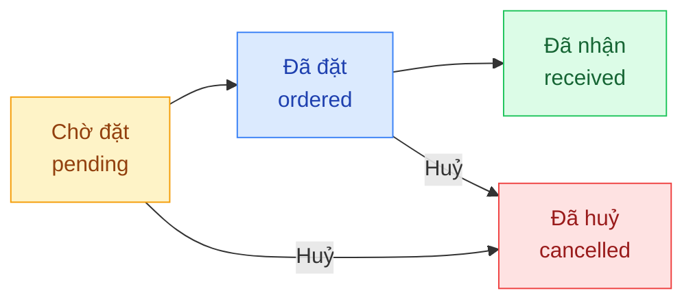
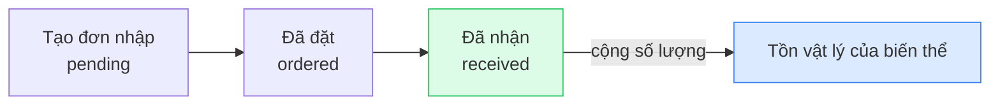

## Mô tả

Trang **Đơn nhập hàng** quản lý các đơn mua hàng (purchase orders) từ nhà cung cấp về kho. Khi một đơn nhập chuyển sang trạng thái **Đã nhận**, **Tồn kho vật lý** của biến thể tương ứng sẽ được cộng tự động.

## Cách truy cập

Menu bên trái → **Đơn nhập hàng** (mục **Kho vận**).

## Vòng đời đơn nhập

### Ý nghĩa từng trạng thái

| Trạng thái | Nhãn hiển thị | Ý nghĩa |
|-----------|---------------|---------|
| `pending` | **Chờ đặt** | Đơn vừa tạo, chưa liên hệ nhà cung cấp |
| `ordered` | **Đã đặt** | Đã đặt hàng với NCC, đang chờ về kho |
| `received` | **Đã nhận** | Hàng đã về — tồn kho vật lý đã cộng tự động |
| `cancelled` | **Đã huỷ** | Đơn đã huỷ |

<Note>
Việc chuyển trạng thái (xác nhận đặt hàng, xác nhận nhận hàng, huỷ) hiện được thực hiện qua API quản trị. Trang admin hiển thị trạng thái dạng đọc và cho phép lọc — chưa có nút chuyển trạng thái trong giao diện.
</Note>

## Bộ lọc và tìm kiếm

| Thành phần | Mô tả |
|-----------|-------|
| **Tìm theo SKU, sản phẩm, ghi chú...** | Ô tìm kiếm với debounce 300ms |
| **Trạng thái** | Dropdown: Tất cả · Chờ đặt · Đã đặt · Đã nhận · Đã huỷ |
| **Tạo đơn nhập** | Nút mở dialog tạo đơn mới |

## Cột bảng danh sách

| Cột | Nội dung |
|-----|---------|
| **Sản phẩm** | Tên sản phẩm + tên biến thể (nếu có) |
| **SKU** | Mã SKU của biến thể |
| **SL** | Số lượng đặt nhập |
| **Trạng thái** | Pill màu theo trạng thái |
| **Ngày dự kiến** | Ngày dự kiến nhận hàng (định dạng vi-VN) |
| **Ngày tạo** | Ngày tạo đơn nhập |

## Tạo đơn nhập mới

<Steps>
  <Step title="Mở dialog tạo đơn">
    Nhấn **Tạo đơn nhập** ở góc phải thanh công cụ → dialog **Tạo đơn nhập hàng** mở ra.
  </Step>
  <Step title="Chọn biến thể sản phẩm">
    Dropdown **Sản phẩm** liệt kê tất cả biến thể của tất cả sản phẩm theo định dạng **Tên SP — Tên biến thể (SKU)**. Chọn đúng biến thể cần nhập.
  </Step>
  <Step title="Nhập số lượng">
    Trường **Số lượng** — số nguyên ≥ 1.
  </Step>
  <Step title="Nhập ngày dự kiến (tuỳ chọn)">
    Trường **Ngày dự kiến** dùng input dạng date — chọn ngày NCC giao hàng.
  </Step>
  <Step title="Ghi chú (tuỳ chọn)">
    Textarea **Ghi chú** — ví dụ: "Đặt gấp cho đơn #123".
  </Step>
  <Step title="Lưu đơn">
    Nhấn **Tạo đơn**. Đơn xuất hiện trong danh sách ở trạng thái **Chờ đặt** (`pending`).
  </Step>
</Steps>

<Warning>
Form tạo đơn hiện **không có ô Nhà cung cấp** và **không có ô Giá vốn**. Việc gắn NCC và ghi nhận giá vốn cho biến thể được xử lý bằng cách khác (gắn NCC mặc định cho sản phẩm hoặc cập nhật giá vốn ở trang Sản phẩm).
</Warning>

## Ảnh hưởng đến tồn kho

- Đơn ở trạng thái `pending` hoặc `ordered` **không** ảnh hưởng tồn kho.
- Khi đơn chuyển sang `received`, **Tồn vật lý** (`onHand`) của biến thể được cộng đúng bằng **Số lượng** đã đặt.
- Đơn `cancelled` không thay đổi tồn kho.

<Note>
Để xem các đợt nhập đã ảnh hưởng đến tồn kho, vào trang **Quản lý kho** → tab **Tồn kho** kiểm tra cột **Tồn vật lý**.
</Note>
