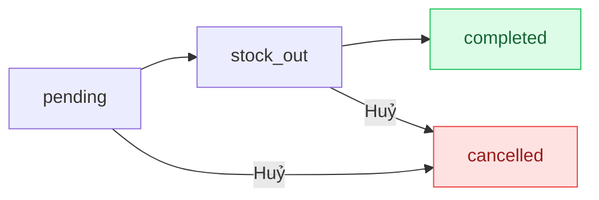

## Mô tả

Trang **Đơn hàng** là nơi nhân viên xử lý đơn hàng hàng ngày. Mỗi đơn có **2 trạng thái song song**:

- **Trạng thái thanh toán** (`paymentStatus`): theo dõi tiền đã thu.
- **Trạng thái xử lý** (`fulfillmentStatus`): theo dõi giao hàng / hoàn thành.

## Cách truy cập

Menu bên trái → **Đơn hàng**.

## Trạng thái đơn hàng

### Trạng thái thanh toán

| Mã | Hiển thị | Ý nghĩa |
|----|---------|---------|
| `unpaid` | Chưa thanh toán | Khách chưa trả đồng nào |
| `partial` | Một phần | Đã thu một phần, vẫn còn nợ |
| `paid` | Đã thanh toán | Đã thu đủ |

### Trạng thái xử lý

| Mã | Hiển thị | Ý nghĩa |
|----|---------|---------|
| `pending` | Chờ xử lý | Đơn vừa tạo |
| `stock_out` | Đã xuất kho | Hàng đã lấy khỏi kho |
| `completed` | Hoàn thành | Khách đã nhận |
| `cancelled` | Đã huỷ | Đơn bị huỷ |

### Vòng đời chuẩn

## Trang danh sách

### Tab lọc

**Tất cả** · **Chờ xử lý** · **Đã xuất kho** · **Hoàn thành** · **Đã huỷ**.

### Tìm kiếm & hành động

- Ô **Tìm mã đơn, khách hàng...** — debounce 300ms.
- **Xuất Excel** — xuất danh sách hiện tại.
- **Tạo đơn** — chuyển đến `/orders/new` cho đơn thủ công.

### Cột bảng

Mã đơn · Khách hàng · SĐT · Số lượng · Tổng tiền · Thanh toán · Trạng thái · Thời gian · Chi tiết.

### Phân trang

**10 / 25 / 50 / 100** mỗi trang. Mặc định **25**.

## Tạo đơn hàng thủ công

`/orders/new` — 2 cột:

### Cột trái

<Steps>
  <Step title="Chọn khách">
    Tìm khách có sẵn (debounce 300ms) hoặc tạo **Khách mới** với Tên (bắt buộc) + SĐT.
  </Step>
  <Step title="Thêm sản phẩm">
    Selector sản phẩm → chọn biến thể → tự thêm vào bảng (SL = 1).
  </Step>
  <Step title="Tinh chỉnh">
    Trong bảng đổi SL, đặt giá tuỳ biến hoặc xoá dòng.
  </Step>
</Steps>

### Cột phải

| Thẻ | Mô tả |
|-----|------|
| **Ghi chú đơn hàng** | Ghi chú nội bộ |
| **Địa chỉ giao hàng** | Người nhận, SĐT nhận, Địa chỉ — tuỳ chọn |
| **Phí ship** | Switch **Trả phí ship hộ khách** + ô số tiền |
| **Tổng quan** | Tạm tính · Phí ship · Tổng cộng + nút **Tạo đơn hàng** |

## Trang chi tiết đơn — Các thao tác chính

<Steps>
  <Step title="Ghi nhận thanh toán">
    Nhấn nút **Thanh toán** → nhập số tiền, phương thức (Tiền mặt / Chuyển khoản / Thẻ), mã tham chiếu (chỉ với Chuyển khoản), ghi chú → **Lưu thanh toán**.
  </Step>
  <Step title="Xuất kho">
    Khi đã lấy hàng, nhấn **Xuất kho** trên header. Tồn kho chuyển từ "giữ chỗ" sang đã xuất.
  </Step>
  <Step title="Hoàn tất đơn">
    Khi khách đã nhận, nhấn **Hoàn tất đơn** (chỉ hiện khi `stock_out` + đã thanh toán đủ).
  </Step>
  <Step title="Huỷ đơn">
    Đơn `pending` hoặc `stock_out` có thể huỷ. Nhấn **Huỷ đơn** → nhập ghi chú → xác nhận. Tồn kho được hoàn trả tự động.
  </Step>
  <Step title="Sửa danh sách sản phẩm">
    Chỉ với đơn `pending` không phải đơn cha/con. Nhấn **Sửa** trong thẻ "Chi tiết sản phẩm" → đổi SL/giá/xoá → **Lưu**.
  </Step>
  <Step title="Xuất hoá đơn">
    Dropdown **Xuất hoá đơn** ở header → **Sao chép** (vào clipboard), **Xuất file ảnh** (PNG), hoặc **Xuất file PDF**.
  </Step>
</Steps>

### Lịch sử thanh toán

Bảng dưới phần chi tiết — mỗi lần thu là 1 dòng: Thời gian · Phương thức · Ghi chú/Mã · Số tiền · Người thu.

### Lịch sử trạng thái

Dòng thời gian cho biết ai chuyển trạng thái khi nào, kèm ghi chú.

<Note>
Đơn hỗ trợ thanh toán nhiều lần. `partial` xuất hiện khi đã thu nhưng chưa đủ.
</Note>

<Warning>
Chỉ có thể xoá đơn ở trạng thái **Đã huỷ**. Việc xoá là **không thể hoàn tác**.
</Warning>
